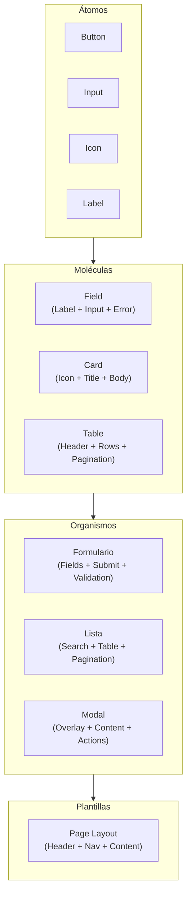

# Estrategia de Frontend Web

> **Estándares de Referencia:** ADR-0055 (microfrontends), ADR-0004 (resiliencia offline), [OWASP ASVS v4.0](https://owasp.org/www-project-application-security-verification-standard/) (seguridad frontend), [W3C WCAG 2.2](https://www.w3.org/TR/WCAG22/) (accesibilidad).
> **Propósito:** Definir la estrategia de desarrollo frontend web: framework, arquitectura, diseño atómico, rendimiento, pruebas, seguridad y accesibilidad.

---

## 1. Stack Tecnológico Frontend

| Componente | Tecnología | Propósito | Alternativa |
| :--------- | :--------- | :-------- | :---------- |
| **Framework UI** | [React 18+](https://react.dev/) | Biblioteca de UI declarativa con hooks, Suspense, Concurrent Mode | Ninguna (decisión corporativa) |
| **Bundler** | [Vite 5+](https://vitejs.dev/) | Build rápido con HMR nativo, tree-shaking, code splitting | Webpack (migrar a Vite) |
| **Lenguaje** | [TypeScript 5+ (modo estricto)](https://www.typescriptlang.org/) | Type-safe, null-safety, interfaces compartidas con backend | JavaScript (desaconsejado) |
| **Enrutamiento** | [React Router v6](https://reactrouter.com/) | Routing declarativo con loaders, actions, lazy loading | TanStack Router |
| **Estado global** | [TanStack Query (React Query) v5](https://tanstack.com/query/latest) | Server state: caching, stale-while-revalidate, optimistic updates, paginación | Redux Toolkit (solo estado local complejo) |
| **Estado local complejo** | [Zustand](https://github.com/pmndrs/zustand) | Estado local liviano sin boilerplate | Context API (casos simples) |
| **Formularios** | [React Hook Form v7](https://react-hook-form.com/) | Formularios performantes con validación | Formik |
| **Validación** | [Zod](https://zod.dev/) | Schemas type-safe compartibles con backend (Node.js) | Yup |
| **Peticiones HTTP** | [Ky](https://github.com/sindresorhus/ky) / [Axios](https://axios-http.com/) | Cliente HTTP con interceptors, retry, timeouts | fetch nativo |
| **Testing unitario** | [Vitest](https://vitest.dev/) | Tests rápidos tipo Jest con compatibilidad Vite | Jest |
| **Testing componente** | [React Testing Library](https://testing-library.com/react) | Tests centrados en comportamiento de usuario | Enzyme (deprecado) |
| **Testing E2E** | [Playwright](https://playwright.dev/) | Automatización multi-navegador, mobile, API mocking | Cypress |
| **Linting** | [ESLint v9](https://eslint.org/) + [typescript-eslint](https://typescript-eslint.io/) | Reglas estrictas de código frontend | — |
| **Formateo** | [Prettier v3](https://prettier.io/) | Formateo automático de código | — |
| **Accesibilidad** | [axe-core](https://www.deque.com/axe/) + [eslint-plugin-jsx-a11y](https://github.com/jsx-eslint/eslint-plugin-jsx-a11y) | Auditoría automatizada de accesibilidad | Lighthouse CI |

> **Decisión:** React es el framework corporativo. No se permite Vue, Angular, Svelte ni otros sin ADR que justifique la excepción.

---

## 2. Arquitectura Frontend

### 2.1 Estructura de Proyecto

```
src/
├── app/                    # Configuración de la aplicación (router, providers, layout)
│   ├── router.tsx
│   ├── providers.tsx
│   └── layouts/
├── features/               # Módulos por funcionalidad (feature folders)
│   ├── despachos/
│   │   ├── components/     # Componentes específicos del feature
│   │   ├── hooks/          # Custom hooks del feature
│   │   ├── pages/          # Páginas del feature (lazy-loaded)
│   │   ├── services/       # Llamadas API del feature
│   │   ├── types/          # Tipos TypeScript del feature
│   │   └── index.ts
│   └── auth/
├── shared/                 # Código compartido entre features
│   ├── components/         # Componentes reutilizables (Atomic Design)
│   ├── hooks/              # Hooks genéricos
│   ├── lib/                # Utilidades, helpers
│   ├── types/              # Tipos globales
│   └── ui/                 # Design System (atoms, molecules, organisms)
├── styles/                 # Tokens CSS, temas, variables
└── test/                   # Setup de testing, mocks globales
```

### 2.2 Principios Arquitectónicos

| Principio | Descripción | ¿Por qué? |
| :-------- | :---------- | :-------- |
| **Feature-based** | Agrupar por funcionalidad, no por tipo técnico | Escalabilidad: un feature puede extraerse como MFE independiente |
| **Lazy loading por ruta** | Cada página se carga bajo demanda | Bundle inicial < 200 KB, Core Web Vitals optimizados |
| **Server state centralizado** | TanStack Query gestiona caché, sincronización y re-fetch | Evita estados inconsistentes entre componentes |
| **UI sin lógica de negocio** | Los componentes solo renderizan. La lógica está en hooks/servicios | Testeabilidad: componentes puros, lógica testeable por separado |
| **Contratos compartidos** | Tipos TypeScript compartidos entre frontend y backend (NestJS) | Zero discrepancia entre API y consumo |
| **Offline-first** | React Query + Service Worker para experiencia offline parcial | ADR-0004 |

### 2.3 Atomic Design (Sistema de Diseño)



| Nivel | Descripción | Ejemplos |
| :---- | :---------- | :------- |
| **Átomos** | Componentes básicos sin dependencia de negocio | `Button`, `Input`, `Icon`, `Label`, `Spinner` |
| **Moléculas** | Combinación de átomos con funcionalidad concreta | `Field`, `Card`, `Table`, `SearchBar` |
| **Organismos** | Secciones complejas que combinan moléculas | `LoginForm`, `DespachoList`, `UserModal` |
| **Plantillas** | Layouts de página con slots para organismos | `MainLayout`, `AuthLayout` |

### 2.4 Microfrontends (Evolución)

| Fase | Estrategia | Cuándo |
| :--- | :--------- | :----- |
| **F1** | Monolítico modular (feature folders) | Proyecto nuevo, < 5 features |
| **F2** | Librería compartida de componentes (Design System como paquete npm) | Crecimiento a 2-3 equipos |
| **F3+** | Module Federation (Webpack 5) o Vite Module Federation | Equipos independientes por dominio |

> Ver ADR-0055 para detalles de evolución.

---

## 3. Estrategia de Pruebas Frontend

| Tipo | Herramienta | Cobertura | ¿Cuándo? | Objetivo |
| :--- | :---------- | :-------- | :------- | :------- |
| **Unitarias (componentes)** | Vitest + React Testing Library | 80%+ de componentes | Cada commit | Validar que el componente renderiza correctamente con diferentes props |
| **Integración (hooks + servicios)** | Vitest + MSW (Mock Service Worker) | 80%+ de hooks | Cada push | Validar que el hook maneja loading, error, empty, success |
| **E2E (flujos críticos)** | Playwright | 100% flujos críticos | RC | Validar login, creación de despacho, búsqueda, cierre de sesión |
| **Accesibilidad** | axe-core + Lighthouse CI | 100% páginas | Cada push + RC | Cero violaciones de accesibilidad (WCAG 2.2 AA) |
| **Rendimiento** | Lighthouse CI + Web Vitals | 100% páginas | RC | Core Web Vitals: LCP < 2.5s, FID < 100ms, CLS < 0.1 |

```javascript
// Ejemplo: Test de componente con Vitest + React Testing Library
import { render, screen } from '@testing-library/react';
import userEvent from '@testing-library/user-event';
import { Button } from './Button';

describe('Button', () => {
  it('renderiza el texto y maneja click', async () => {
    const onClick = vi.fn();
    render(<Button onClick={onClick}>Enviar</Button>);
    await userEvent.click(screen.getByText('Enviar'));
    expect(onClick).toHaveBeenCalledOnce();
  });
});
```

---

## 4. Estrategia de Rendimiento

| Métrica | Objetivo | Herramienta | ¿Cómo lograrlo? |
| :------ | :------- | :---------- | :-------------- |
| **LCP (Largest Contentful Paint)** | < 2.5s | Lighthouse, Web Vitals | Lazy loading de rutas, imágenes optimizadas, code splitting |
| **FID (First Input Delay)** | < 100ms | Lighthouse, Web Vitals | Bundle JS mínimo, lazy load de handlers pesados |
| **CLS (Cumulative Layout Shift)** | < 0.1 | Lighthouse, Web Vitals | Dimensiones fijas en imágenes, skeleton screens |
| **Bundle inicial** | < 200 KB | Vite bundle analyzer | Code splitting por ruta, tree-shaking, dynamic imports |
| **Tiempo de carga (p50)** | < 3s | Grafana, RUM | CDN, caching TanStack Query, prefetch de datos |

### Patrones de Rendimiento

| Patrón | Implementación | Cuándo usarlo |
| :----- | :------------- | :------------ |
| **Code Splitting** | `React.lazy(() => import('./features/despachos/pages'))` | Cada página del router |
| **Image Optimization** | Next.js Image / vite-imagetools | Imágenes > 10 KB |
| **Prefetching** | TanStack Query `prefetchQuery` | Datos que el usuario probablemente solicitará |
| **Optimistic Updates** | TanStack Query `onMutate` mutaciones | Operaciones CRUD con baja probabilidad de error |
| **Debounced Search** | Custom hook con `useDebounce` | Búsquedas en tiempo real |

---

## 5. Estrategia de Seguridad Frontend

| Riesgo | Mitigación | Herramienta | Referencia |
| :----- | :--------- | :---------- | :--------- |
| **XSS** | Sanitización de inputs, CSP header, React `dangerouslySetInnerHTML` prohibido | ESLint react/jsx-no-danger, CSP | [OWASP XSS](https://owasp.org/www-community/attacks/xss/) |
| **CSRF** | Tokens CSRF en headers, SameSite cookies | Ky/Axios con interceptors | [OWASP CSRF](https://owasp.org/www-community/attacks/csrf) |
| **Exposición de datos sensibles** | No almacenar tokens en localStorage. Usar cookies httpOnly | Vault + BFF | [Estrategia de Seguridad](../../sdlc/estrategia-seguridad.es.md) |
| **Dependencias vulnerables** | SCA continuo, renovación automática de dependencias | Snyk / Renovate | [Plan de Seguridad](../testing/plan-seguridad.es.md) |
| **Clickjacking** | Cabecera X-Frame-Options: DENY | Servidor web / Ingress | [OWASP Clickjacking](https://owasp.org/www-community/attacks/Clickjacking) |

---

## 6. Herramientas

| Herramienta | Propósito | Instalación | Uso | Licencia |
| :---------- | :-------- | :---------- | :-- | :------- |
| [React 18](https://react.dev/) | Framework UI declarativo | `npm create vite@latest` | [docs](https://react.dev/reference/react) | MIT |
| [Vite 5](https://vitejs.dev/) | Bundler y dev server | `npm create vite@latest` | [docs](https://vitejs.dev/guide/) | MIT |
| [TypeScript 5](https://www.typescriptlang.org/) | Lenguaje type-safe | `npm install typescript` | [docs](https://www.typescriptlang.org/docs/) | Apache 2.0 |
| [TanStack Query v5](https://tanstack.com/query/latest) | Server state management | `npm install @tanstack/react-query` | [docs](https://tanstack.com/query/latest/docs/) | MIT |
| [Zustand](https://github.com/pmndrs/zustand) | Estado local | `npm install zustand` | [docs](https://docs.pmnd.rs/zustand) | MIT |
| [React Hook Form](https://react-hook-form.com/) | Formularios | `npm install react-hook-form` | [docs](https://react-hook-form.com/get-started) | MIT |
| [Zod](https://zod.dev/) | Validación type-safe | `npm install zod` | [docs](https://zod.dev/) | MIT |
| [Vitest](https://vitest.dev/) | Testing unitario | `npm install vitest` | [docs](https://vitest.dev/guide/) | MIT |
| [React Testing Library](https://testing-library.com/react) | Testing de componentes | `npm install @testing-library/react` | [docs](https://testing-library.com/docs/react-testing-library/intro) | MIT |
| [Playwright](https://playwright.dev/) | Testing E2E multi-navegador | `npm init playwright` | [docs](https://playwright.dev/docs/intro) | Apache 2.0 |
| [MSW](https://mswjs.io/) | Mock de API en tests | `npm install msw` | [docs](https://mswjs.io/docs/) | MIT |
| [axe-core](https://www.deque.com/axe/) | Auditoría de accesibilidad | `npm install @axe-core/react` | [docs](https://www.deque.com/axe/core-documentations/) | MPL 2.0 |

---

## 7. Documentos Relacionados

| Documento | Propósito |
| :-------- | :-------- |
| ADR-0055 — Microfrontends | Evolución de frontend monolítico a microfrontends |
| ADR-0004 — Resiliencia Offline | React Query, optimistic updates, stale-while-revalidate |
| [Estándar de Diseño de API](./estandar-diseno-api.es.md) | Contratos API que el frontend consume |
| [Estrategia de Pruebas](../../sdlc/estrategia-pruebas.es.md) | Pirámide 70/20/10 aplicada a frontend |
| [Plan de Seguridad](../testing/plan-seguridad.es.md) | DAST, SAST, SCA para frontend |
| [Manifiesto de Ingeniería](./manifiesto-ingenieria.md) | Principios SOLID, DRY, KISS, test-first |

---

[Volver a Fase 2 — Diseño y Arquitectura](../../../navigation/indices/fase-2-diseno-arquitectura.md)
