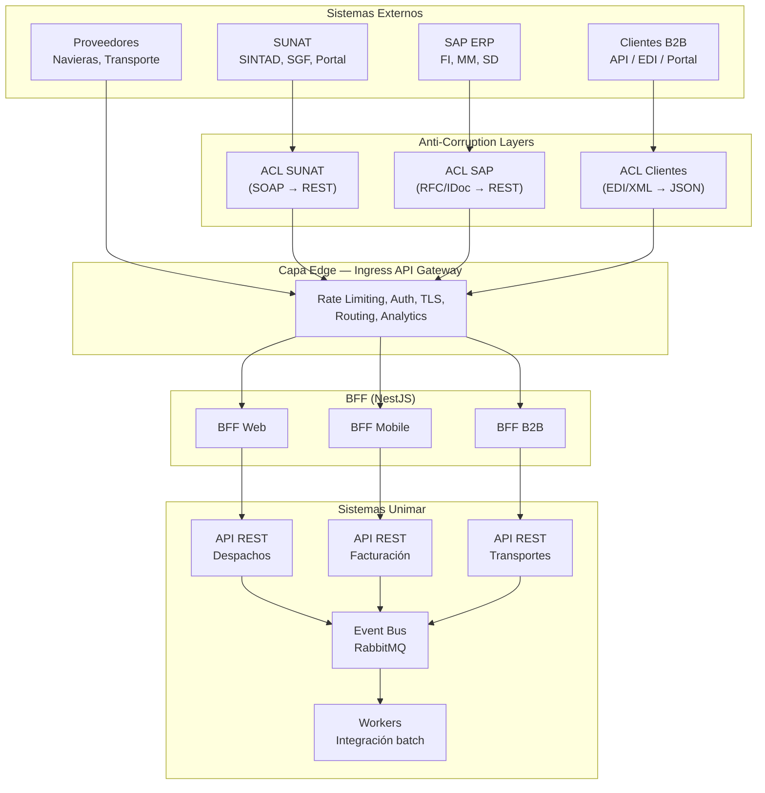

# Estrategia de Integraciones Corporativas

> **Estándares de Referencia:** ADR-0030 (API Gateway 2 niveles), ADR-0027 (REST/gRPC), ADR-0015 (eventos), ADR-0036 (mensajería), [NIST SP 800-161](https://csrc.nist.gov/publications/detail/sp/800-161/rev-1/final) (Supply Chain Risk Management).
> **Propósito:** Definir la estrategia de integración con sistemas externos (SUNAT, SAP, aduanas, clientes B2B, proveedores) y entre servicios internos, con patrones, protocolos, seguridad y monitoreo.

---

## 1. Topología de Integración



---

## 2. Estrategia por Tipo de Integración

### 2.1 Integraciones con Entidades Gubernamentales (SUNAT)

| Aspecto | Detalle |
| :------ | :------ |
| **Propósito** | Intercambio de datos con SUNAT para trámite aduanero: DUA, numeración, levante, pago de tributos |
| **¿Por qué?** | SUNAT es el ente fiscal peruano. Sin integración, el negocio aduanero no puede operar |
| **Protocolo** | SOAP → ACL transforma a REST interno. SUNAT migra gradualmente a APIs REST |
| **Seguridad** | Certificados digitales SUNAT, mTLS, IP whitelisting. Ver [Plan de Seguridad](../testing/plan-seguridad.es.md) |
| **ACL** | Anti-Corruption Layer dedicada: traduce SOAP/XML a REST/JSON. Ver §3 |
| **Monitoreo** | Dashboard específico de latencia y tasa de error por endpoint SUNAT |
| **Ejemplo** | `POST /api/v1/sunat/dua/numerar` → ACL transforma a SOAP → SUNAT → respuesta → ACL transforma a JSON |

### 2.2 Integraciones con ERP Corporativo (SAP)

| Aspecto | Detalle |
| :------ | :------ |
| **Propósito** | Sincronización de datos financieros, logísticos y de materiales entre Unimar y SAP |
| **¿Por qué?** | SAP es el sistema financiero oficial. Datos maestros (clientes, tarifas) deben sincronizarse |
| **Protocolo** | RFC / IDoc / OData (SAP Gateway) → ACL transforma a REST |
| **Patrón** | Event-driven: SAP publica IDoc → Worker consume → Event Bus Unimar |
| **Frecuencia** | Batch cada 15 min para maestros. Tiempo real para datos críticos |
| **ACL** | ACL SAP dedicada que encapsula la complejidad RFC/IDoc |
| **Ejemplo** | SAP publica IDoc `DEBMAS` (cliente) → Worker recibe → Event Bus → `clientes` API actualiza |

### 2.3 Integraciones con Clientes B2B

| Aspecto | Detalle |
| :------ | :------ |
| **Propósito** | Clientes externos consultan estados de despacho, descargan documentación, crean órdenes |
| **¿Por qué?** | Diferenciador competitivo: cliente puede auto-gestionar sin llamar a Unimar |
| **Protocolo** | REST (público) via Ingress. OPCIONAL: EDI para clientes legacy |
| **Autenticación** | OAuth 2.0 Client Credentials + API Keys para clientes B2B |
| **Rate Limiting** | Por plan (tiers): Basic 100 req/min, Premium 1000 req/min |
| **Documentación** | OpenAPI 3.1 + Developer Portal (Ingress) |
| **Ejemplo** | Cliente B2B → `GET /api/v1/b2b/despachos?ruc=20100412447` → Autenticación → Ingress → BFF B2B → API Despachos |

### 2.4 Integraciones con Proveedores (Navieras, Transporte)

| Aspecto | Detalle |
| :------ | :------ |
| **Propósito** | Recepción de data de trazabilidad: BL, ETA, booking, contenedores |
| **¿Por qué?** | Sin data del proveedor, Unimar no puede planificar recepción ni almacenaje |
| **Protocolo** | REST (preferido) o SFTP para archivos EDI/XML |
| **Patrón** | Push (API callback) o Pull (Worker programado cada 30 min) |
| **Seguridad** | API Keys + IP whitelisting |
| **Ejemplo** | Naviera → `POST /api/v1/prov/bl` → Ingress → Worker procesa → Event Bus → sistema Contenedores |

### 2.5 Integraciones Internas (Entre Servicios Unimar)

| Aspecto | Detalle |
| :------ | :------ |
| **Propósito** | Comunicación entre los microservicios/módulos de la suite Unimar |
| **¿Por qué?** | La suite Unimar tiene 12+ sistemas que deben interoperar |
| **Protocolo** | REST (síncrono) + RabbitMQ (asíncrono). gRPC para alta performance interna |
| **Gateway** | Ingress (edge) + NestJS BFF (internas). Servicios no se llaman directamente |
| **Resiliencia** | Circuit breaker (opossum/Polly), retry, timeout, bulkhead. Ver ADR-0011 |
| **Contratos** | Pact contract testing obligatorio. Ver [Guía de Pruebas de Contrato](./guia-pruebas-contrato.es.md) |
| **Ejemplo** | API Despachos → Event Bus → API Contenedores actualiza estado. Todo vía RabbitMQ con DLQ |

---

## 3. Anti-Corruption Layer (ACL)

### Propósito

Aislar el dominio de Unimar de la complejidad, protocolos y modelos de datos de sistemas externos. Cada ACL encapsula:
- Traducción de protocolo (SOAP → REST, RFC → REST, EDI → JSON)
- Traducción de modelo de datos (XML → TypeScript types)
- Manejo de errores del sistema externo
- Circuit breaker específico para el externo
- Monitoreo de latencia y disponibilidad del externo

### Estructura Recomendada

```
acls/
├── sunat/
│   ├── sunat.acl.ts          # Configuración de conexión, certificados
│   ├── sunat.mapper.ts       # Transformación XML SOAP ↔ JSON
│   ├── sunat.client.ts       # Cliente HTTP SOAP
│   ├── sunat.types.ts        # Tipos del modelo SUNAT
│   └── sunat.errors.ts       # Mapeo de errores SUNAT a errores de dominio
├── sap/
│   ├── sap.acl.ts
│   ├── sap.mapper.ts
│   ├── sap.client.ts
│   └── sap.types.ts
└── clientes/
    └── ...
```

---

## 4. Seguridad en Integraciones

| Aspecto | Medida | Referencia |
| :------ | :----- | :--------- |
| **Autenticación** | OAuth 2.0 Client Credentials + JWT para internas. mTLS para críticas | ADR-0020 |
| **Autorización** | RBAC por API Key + scope. Ingress valida tokens en edge | [Estrategia de Seguridad](../../sdlc/estrategia-seguridad.es.md) |
| **Cifrado en tránsito** | TLS 1.2+ obligatorio en todas las integraciones | [Plan de Seguridad](../testing/plan-seguridad.es.md) |
| **Rate Limiting** | Por cliente IP + API Key. Ingress + Redis | ADR-0030 |
| ** Auditoría** | Cada request externo se loguea con traceId, timestamp, payload hash | Loki + OpenTelemetry |
| **Network Segregation** | VPC separada para integraciones externas. Sin acceso directo a BD | [Infraestructura](../../../infrastructure/README.md) |

---

## 5. Herramientas

| Herramienta | Propósito | Instalación | Uso | Licencia |
| :---------- | :-------- | :---------- | :-- | :------- |
| [Ingress Controller](https://kubernetes.io/docs/concepts/services-networking/ingress/) | API Gateway de borde con rate limiting, auth, routing | [guía](https://kubernetes.github.io/ingress-nginx/deploy/) | [docs](https://kubernetes.io/docs/concepts/services-networking/ingress/) | Apache 2.0 |
| [RabbitMQ](https://www.rabbitmq.com/) | Mensajería asíncrona FIFO + DLQ | [instalación](https://www.rabbitmq.com/download.html) | [docs](https://www.rabbitmq.com/documentation.html) | MPL 2.0 |
| [NestJS](https://nestjs.com/) | BFF por canal + workers de integración | `npm install @nestjs/core` | [docs](https://docs.nestjs.com/) | MIT |
| [Pact](https://pact.io/) | Contract testing entre servicios | `npm install @pact-foundation/pact` | [docs](https://docs.pact.io/) | MIT |
| [OpenTelemetry](https://opentelemetry.io/) | Trazabilidad distribuida de integraciones | [SDK](https://opentelemetry.io/docs/languages/) | [docs](https://opentelemetry.io/docs/) | Apache 2.0 |
| [Grafana Loki](https://grafana.com/oss/loki/) | Logs de auditoría de integraciones | [instalación](https://grafana.com/docs/loki/latest/installation/) | [docs](https://grafana.com/docs/loki/latest/) | AGPL 3.0 |
| [MinIO](https://min.io/) | Almacenamiento de archivos EDI/XML de integraciones batch | [guía](https://min.io/docs/minio/container/index.html) | [docs](https://min.io/docs/) | AGPL 3.0 |
| [Postman](https://www.postman.com/) | Pruebas de integración de APIs externas | [descarga](https://www.postman.com/downloads/) | [docs](https://learning.postman.com/docs/getting-started/introduction/) | Free / Team (paga) |

---

## 6. Monitoreo de Integraciones

| Métrica | SLO | Alarma si |
| :------ | :-- | :-------- |
| **Latencia por externo** (SUNAT, SAP, etc.) | p95 < 5s | > 5s por 5 min |
| **Tasa de error por externo** | < 2% | > 2% por 5 min |
| **Disponibilidad por externo** | > 99.5% | < 99.5% en ventana de 1h |
| **Mensajes en DLQ** | 0 | > 0 por 5 min |
| **Tiempo de procesamiento batch** | < 30 min | > 45 min |

> Cada integración externa DEBE tener un dashboard Grafana específico con latencia, error rate, disponibilidad y últimas N transacciones.

---

## 7. ADRs Relacionados

| ADR | Título | ¿Qué define? |
| :-- | :----- | :----------- |
| ADR-0030 | API Gateway 2 niveles | Ingress Edge + NestJS BFF |
| ADR-0027 | Protocolo Dual REST/gRPC | REST para externo, gRPC para interno |
| ADR-0032 | Matriz Protocolos API | REST vs gRPC vs GraphQL |
| ADR-0015 | Eventos Intradominio | Event bus in-memory / RabbitMQ |
| ADR-0036 | Bus Mensajes FIFO/DLQ | Estrategia de entrega de mensajes |
| ADR-0011 | Resiliencia | Circuit breaker, retry, timeout |
| ADR-0047 | Monolito → Microservicios | Evolución progresiva |

---

## 8. Documentos Relacionados

| Documento | Propósito |
| :-------- | :-------- |
| [Estándar de Diseño de API](./estandar-diseno-api.es.md) | Formato de respuesta, errores, versionado, paginación |
| [Guía de Pruebas de Contrato](./guia-pruebas-contrato.es.md) | Contract testing con Pact por integración |
| [Estrategia de Seguridad](../../sdlc/estrategia-seguridad.es.md) | SAST, DAST, SCA aplicado a integraciones |
| [Plan de Seguridad](../testing/plan-seguridad.es.md) | mTLS, API Keys, cifrado en integraciones |
| [Hub de Infraestructura](../../../infrastructure/README.md) | VPC, network segregation, Ingress deployment |
| [Estrategia de Monitoreo](./estrategia-monitoreo.es.md) | Dashboards, alertas, SLIs/SLOs por integración |

---

[Volver a Fase 2 — Diseño y Arquitectura](../../../navigation/indices/fase-2-diseno-arquitectura.md)
