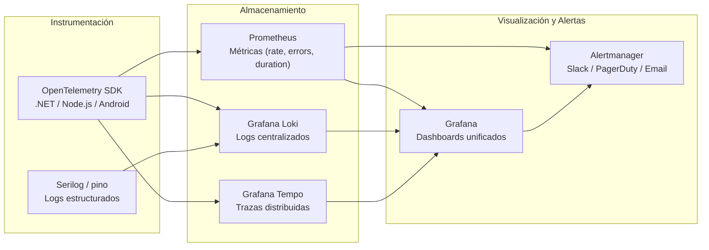

# Estrategia de Monitoreo

> **Estándares de Referencia:** [OpenTelemetry](https://opentelemetry.io/) (instrumentación vendor-neutral), [RED Method](https://www.weave.works/blog/the-red-method-key-metrics-for-microservices/) (Rate, Errors, Duration), [USE Method](https://www.brendangregg.com/usemethod.html) (Utilization, Saturation, Errors), [Google SRE](https://sre.google/sre-book/) (SLIs, SLOs, Error Budgets).
> **Propósito:** Definir la estrategia de monitoreo corporativo: herramientas estándar, métricas clave, dashboards, alertas, SLIs/SLOs y ejemplos de uso para cada capa del stack.

---

## 1. Stack de Monitoreo



### Stack por Componente

| Componente | Herramienta | Propósito | Alternativa |
| :--------- | :---------- | :-------- | :---------- |
| **Métricas** | [Prometheus](https://prometheus.io/) | Recolección de métricas (pull) + Alertmanager | Grafana Mimir (escalable) |
| **Dashboards** | [Grafana](https://grafana.com/) | Visualización unificada de métricas, logs y trazas | — |
| **Logs** | [Grafana Loki](https://grafana.com/oss/loki/) | Agregación de logs estructurados con etiquetado | Elasticsearch (más costo) |
| **Trazas** | [Grafana Tempo](https://grafana.com/oss/tempo/) | Almacenamiento de trazas distribuidas OTel | Jaeger |
| **Alertas** | [Prometheus Alertmanager](https://prometheus.io/docs/alerting/latest/alertmanager/) | Enrutamiento, silenciamiento y deduplicación de alertas | — |
| **Métricas de infra** | [Node Exporter](https://prometheus.io/docs/guides/node-exporter/) | CPU, memoria, disco, red por nodo | — |
| **Métricas K8s** | [kube-state-metrics](https://github.com/kubernetes/kube-state-metrics) | Estado de pods, deployments, servicios | — |
| **RUM (Real User)** | [Grafana Faro](https://grafana.com/oss/faro/) | Métricas de experiencia real de usuario (opcional) | — |

---

## 2. Métricas Clave por Capa

### 2.1 Backend (API / Servicios)

| Métrica | Tipo | Cómo medirla | SLO | Alarma |
| :------ | :--- | :----------- | :-: | :----- |
| **Rate** (requests/s) | RED | `http_requests_total` | ≥ esperado | < 50% del esperado |
| **Error Rate** (5xx) | RED | `http_requests_errors_total / http_requests_total` | < 1% | > 1% por 5 min |
| **Latencia p95** | RED | `http_request_duration_seconds` histogram | < 2s | > 3s por 5 min |
| **Latencia p99** | RED | `http_request_duration_seconds` histogram | < 5s | > 5s por 5 min |
| **Active Requests** | RED | `http_requests_active` gauge | < 100 | > 100 por min |
| **CPU** | USE | `process_cpu_seconds_total` | < 80% | > 85% sostenido |
| **Memoria** | USE | `process_resident_memory_bytes` | < 80% | > 85% sostenido |

**Ejemplo Prometheus query:**
```promql
# Error rate por servicio (últimos 5 min)
rate(http_requests_errors_total{job="api-despachos"}[5m])
/
rate(http_requests_total{job="api-despachos"}[5m])
* 100

# Latencia p95 por endpoint
histogram_quantile(0.95,
  rate(http_request_duration_seconds_bucket{job="api-despachos"}[5m])
)
```

### 2.2 Frontend (Web)

| Métrica | Tipo | Cómo medirla | SLO | Alarma |
| :------ | :--- | :----------- | :-: | :----- |
| **LCP** (Largest Contentful Paint) | Web Vitals | Lighthouse / RUM | < 2.5s | > 3s |
| **FID** (First Input Delay) | Web Vitals | Lighthouse / RUM | < 100ms | > 200ms |
| **CLS** (Cumulative Layout Shift) | Web Vitals | Lighthouse / RUM | < 0.1 | > 0.25 |
| **Page Load Time** | Rendimiento | RUM (Grafana Faro) | < 3s p50 | > 5s |
| **JS Errors** | Estabilidad | Sentry | 0 | Cualquier error |

### 2.3 Base de Datos

| Métrica | Cómo medirla | SLO | Alarma |
| :------ | :----------- | :-: | :----- |
| **Conexiones activas** | `pg_stat_activity` (PG) / `sys.dm_exec_connections` (SQL) | < 80% del pool | > 90% |
| **Queries lentas** | `pg_stat_statements` / SQL Server Extended Events | 0 queries > 5s | Cualquier query > 5s |
| **Deadlocks** | `pg_stat_database` / SQL Server | 0 | > 0 |
| **Tamaño de BD** | `pg_database_size` / SQL Server | < 80% del storage | > 85% |
| **Cache hit ratio** | Buffer cache (PG/SQL) | > 95% | < 90% |

**Ejemplo Prometheus query para queries lentas (PostgreSQL + postgres_exporter):**
```promql
# Queries que tardan más de 5 segundos
pg_stat_activity_max_tx_duration{state="active"} > 5
```

### 2.4 Infraestructura

| Métrica | Cómo medirla | SLO | Alarma |
| :------ | :----------- | :-: | :----- |
| **CPU nodo** | Node Exporter | < 80% | > 85% sostenido |
| **Memoria nodo** | Node Exporter | < 80% | > 85% |
| **Disco** | Node Exporter | < 80% used | > 85% |
| **Pod restarts** | kube-state-metrics | 0 | Cualquier restart no esperado |
| **Disponibilidad K8s** | kube-state-metrics | > 99.9% | < 99.9% |

### 2.5 Mensajería (RabbitMQ)

| Métrica | Cómo medirla | SLO | Alarma |
| :------ | :----------- | :-: | :----- |
| **DLQ depth** | `rabbitmq_queues_messages` | 0 | > 0 |
| **Queue depth** | `rabbitmq_queues_messages` | < 1000 | > 1000 |
| **Tasa de publicación** | `rabbitmq_queues_messages_published_total` | ≥ esperado | < 50% |
| **Tasa de consumo** | `rabbitmq_queues_messages_delivered_total` | ≥ esperado | < 50% |

---

## 3. Dashboards Recomendados (Grafana)

| Dashboard | Destinatario | Métricas incluidas | Data source |
| :-------- | :----------- | :----------------- | :---------- |
| **Backend Service Overview** | DevOps, Desarrolladores | RED (rate, errors, duration), CPU, memoria, request por endpoint | Prometheus |
| **Frontend Web Vitals** | Frontend, UX | LCP, FID, CLS, page load, JS errors | Faro / Sentry |
| **Database Performance** | DBA, DevOps | Conexiones, queries lentas, deadlocks, cache hit ratio, tamaño | Prometheus + postgres_exporter |
| **Infrastructure (K8s)** | DevOps | CPU/Mem/Disco por nodo, pod restarts, disponibilidad | Prometheus + kube-state-metrics |
| **Integrations** | Arquitectura, DevOps | Latencia por externo, error rate, DLQ, disponibilidad | Prometheus + Loki |
| **Business Metrics** | PM, Negocio | Despachos creados/hora, DUAs numerados, tiempos de proceso | API custom exporter |
| **Alertmanager Overview** | DevOps | Alertas firing, silenciadas, historial | Alertmanager |

---

## 4. Estrategia de Alertas

### 4.1 Severidades

| Severidad | Tiempo de respuesta | Canal | Ejemplo |
| :-------- | :------------------ | :---- | :------ |
| **Critical** | < 15 min | PagerDuty / Slack urgente | API caída, error rate > 5%, BD sin conexión |
| **Warning** | < 1 h | Slack | Error rate > 2%, CPU > 85%, queries lentas |
| **Info** | < 24 h | Email / Slack | Deprecación próxima, certificado TLS próximo a expirar |

### 4.2 Reglas de Alerta (Prometheus)

```yaml
# PrometheusRule — ejemplo
groups:
  - name: api-despachos
    rules:
      - alert: HighErrorRate
        expr: |
          rate(http_requests_errors_total{job="api-despachos"}[5m])
          /
          rate(http_requests_total{job="api-despachos"}[5m])
          > 0.01
        for: 5m
        labels:
          severity: critical
        annotations:
          summary: "Error rate > 1% en API Despachos"
          description: "El error rate es {{ $value | humanizePercentage }} en los últimos 5 min"

      - alert: HighLatency
        expr: |
          histogram_quantile(0.95,
            rate(http_request_duration_seconds_bucket{job="api-despachos"}[5m])
          ) > 2
        for: 5m
        labels:
          severity: warning
        annotations:
          summary: "p95 latency > 2s en API Despachos"
          description: "La latencia p95 es {{ $value }}s en los últimos 5 min"

      - alert: DLQNotEmpty
        expr: rabbitmq_queues_messages{queue="dlq-*"} > 0
        for: 1m
        labels:
          severity: warning
        annotations:
          summary: "Mensajes en DLQ"
          description: "La cola {{ $labels.queue }} tiene {{ $value }} mensajes"
```

---

## 5. Ejemplos de Uso por Rol

| Rol | ¿Qué monitorea? | Dashboard principal | Acción ante alerta |
| :-- | :-------------- | :------------------ | :----------------- |
| **DevOps** | Infraestructura, K8s, disponibilidad | Infrastructure Overview, K8s | Escalar pods, revisar logs, ejecutar runbook |
| **Desarrollador** | RED de su servicio, queries lentas | Backend Service Overview | Revisar código, optimizar query, agregar índice |
| **Frontend** | Web Vitals, JS errors | Frontend Web Vitals | Optimizar bundle, lazy loading, revisar errores Sentry |
| **DBA** | Conexiones, queries lentas, deadlocks | Database Performance | Indexar, reescribir query, matar sesiones bloqueantes |
| **QA** | Smoke tests post-deploy | Post-Deploy Verification | Ejecutar rollback si métricas no estables |
| **Security Lead** | SAST/SCA/DAST alerts, CVEs | Security Dashboard | Crear TS para hallazgos críticos |

---

## 6. Herramientas

| Herramienta | Propósito | Instalación | Uso | Licencia |
| :---------- | :-------- | :---------- | :-- | :------- |
| [Prometheus](https://prometheus.io/) | Métricas + Alertmanager | [guía](https://prometheus.io/docs/prometheus/latest/installation/) | [docs](https://prometheus.io/docs/introduction/overview/) | Apache 2.0 |
| [Grafana](https://grafana.com/) | Dashboards y visualización | [instalación](https://grafana.com/docs/grafana/latest/setup-grafana/installation/) | [docs](https://grafana.com/docs/grafana/latest/) | AGPL 3.0 / Cloud (paga) |
| [Grafana Loki](https://grafana.com/oss/loki/) | Logs estructurados | [instalación](https://grafana.com/docs/loki/latest/installation/) | [docs](https://grafana.com/docs/loki/latest/) | AGPL 3.0 |
| [Grafana Tempo](https://grafana.com/oss/tempo/) | Trazas distribuidas | [instalación](https://grafana.com/docs/tempo/latest/setup/) | [docs](https://grafana.com/docs/tempo/latest/) | AGPL 3.0 |
| [OpenTelemetry](https://opentelemetry.io/) | Instrumentación vendor-neutral | [SDK](https://opentelemetry.io/docs/languages/) | [docs](https://opentelemetry.io/docs/) | Apache 2.0 |
| [Node Exporter](https://prometheus.io/docs/guides/node-exporter/) | Métricas de servidor | [guía](https://prometheus.io/docs/guides/node-exporter/) | [docs](https://prometheus.io/docs/guides/node-exporter/) | Apache 2.0 |
| [kube-state-metrics](https://github.com/kubernetes/kube-state-metrics) | Métricas de K8s | [guía](https://github.com/kubernetes/kube-state-metrics#kubernetes-deployment) | [docs](https://github.com/kubernetes/kube-state-metrics) | Apache 2.0 |
| [postgres_exporter](https://github.com/prometheus-community/postgres_exporter) | Métricas de PostgreSQL | [guía](https://github.com/prometheus-community/postgres_exporter) | [docs](https://github.com/prometheus-community/postgres_exporter) | Apache 2.0 |
| [Grafana Faro](https://grafana.com/oss/faro/) | RUM — experiencia real de usuario | [SDK](https://grafana.com/docs/grafana-cloud/monitor-apps/faro/) | [docs](https://grafana.com/docs/grafana-cloud/monitor-apps/faro/) | AGPL 3.0 |

---

## 7. Documentos Relacionados

| Documento | Propósito |
| :-------- | :-------- |
| [Hub de Operaciones](../../../operations/README.md) | Runbooks, troubleshooting, SLIs/SLOs |
| [Guía Post-Despliegue](./guia-post-despliegue.es.md) | Verificación post-despliegue con métricas |
| [Estrategia de Integraciones](./estrategia-integraciones.es.md) | Monitoreo de integraciones externas |
| [Estándar de Diseño de API](./estandar-diseno-api.es.md) | Métricas por endpoint y error codes |
| [Playbook de Observabilidad](./playbook-observabilidad.es.md) | Buenas prácticas de observabilidad |
| [Estrategia de Seguridad](../../sdlc/estrategia-seguridad.es.md) | Monitoreo de seguridad (SAST, SCA, DAST) |

---

[Volver a Fase 2 — Diseño y Arquitectura](../../../navigation/indices/fase-2-diseno-arquitectura.md)
