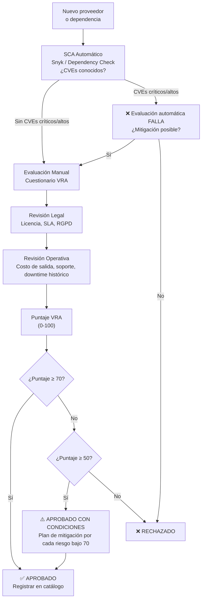

# Evaluación de Riesgo de Proveedor (Vendor Risk Assessment)

> **Estándares de Referencia:** [NIST SP 800-161](https://csrc.nist.gov/publications/detail/sp/800-161/rev-1/final) (Supply Chain Risk Management), [ISO 27001](https://www.iso.org/standard/27001) A.15 (Supplier Relationships), [OWASP Dependency Check](https://owasp.org/www-project-dependency-check/) (SCA).
> **Propósito:** Evaluar el riesgo de incorporar una librería, servicio o producto de terceros al ecosistema Unimar, integrando los hallazgos de SCA, SAST y pruebas de seguridad en la decisión.

---

## 1. Flujo de Evaluación de Proveedor



---

## 2. Cuestionario de Evaluación (VRA Score)

Cada respuesta suma puntos. Puntaje máximo: 100. Mínimo para aprobar sin condiciones: 70.

### Categoría A: Seguridad (40 pts)

| # | Pregunta | Respuesta posible | Puntaje |
| :- | :------- | :---------------- | :------ |
| A1 | ¿El proveedor publica CVEs y parches de seguridad? | Sí / No / Parcial | 10 / 0 / 5 |
| A2 | ¿La dependencia tiene CVEs críticos o altos activos sin parche? | No / Sí con mitigación / Sí sin mitigación | 10 / 5 / 0 |
| A3 | ¿El proveedor usa autenticación multifactor (MFA) en su plataforma? | Sí / No / No aplica (librería) | 5 / 0 / 5 |
| A4 | ¿El proveedor tiene política de divulgación de vulnerabilidades (bug bounty)? | Sí / No | 5 / 0 |
| A5 | ¿El proveedor reporta incidentes de seguridad públicamente? | Sí / No | 5 / 0 |
| A6 | ¿La dependencia es auditada por terceros (SOC 2, ISO 27001)? | Sí / No | 5 / 0 |

### Categoría B: Licencia y Legal (20 pts)

| # | Pregunta | Respuesta posible | Puntaje |
| :- | :------- | :---------------- | :------ |
| B1 | ¿La licencia es compatible con el modelo de negocio de Unimar? | MIT/Apache/GPL3 / Propietaria restrictiva / Sin licencia | 10 / 5 / 0 |
| B2 | ¿El proveedor cumple con RGPD (si aplica)? | Sí / No / No aplica | 5 / 0 / 5 |
| B3 | ¿El SLA incluye penalidades por incumplimiento? | Sí / No / No aplica | 5 / 0 / 5 |

### Categoría C: Operativo (20 pts)

| # | Pregunta | Respuesta posible | Puntaje |
| :- | :------- | :---------------- | :------ |
| C1 | ¿Existe alternativa Open Source o de otro proveedor con funcionalidad equivalente? | Sí / No | 5 / 0 |
| C2 | ¿El costo de salida (migración a alternativa) es bajo? | Bajo / Medio / Alto | 10 / 5 / 0 |
| C3 | ¿El proveedor tiene soporte 24/7 o comunidad activa? | Sí / No | 5 / 0 |

### Categoría D: SCA y Mantenimiento (20 pts)

| # | Pregunta | Respuesta posible | Puntaje |
| :- | :------- | :---------------- | :------ |
| D1 | ¿La dependencia tiene < 12 meses sin release? | < 6 meses / 6-12 meses / > 12 meses | 10 / 5 / 0 |
| D2 | ¿El proveedor publica changelog y release notes? | Sí / No | 5 / 0 |
| D3 | ¿Hay un roadmap público de la dependencia? | Sí / No | 5 / 0 |

---

## 3. Interpretación del Puntaje

| Puntaje | Decisión | Acción |
| :------ | :------- | :----- |
| **≥ 70** | ✅ **APROBADO** | Registrar en catálogo de proveedores aprobados |
| **50 — 69** | ⚠️ **APROBADO CON CONDICIONES** | Documentar plan de mitigación para cada ítem con puntaje bajo. Re-evaluar en 6 meses |
| **< 50** | ❌ **RECHAZADO** | No incorporar. Buscar alternativa. Si no hay alternativa, escalar al Architecture Board |

---

## 4. Relación con Estrategia de Seguridad

La evaluación de proveedor se integra con el flujo de seguridad existente:

| Etapa de Seguridad | Relación con VRA | Documento Relacionado |
| :----------------- | :--------------- | :-------------------- |
| **SCA (Snyk / Dependency Check)** | Aporta los CVEs de la dependencia (ítem A2) | [Estrategia de Seguridad](../../sdlc/estrategia-seguridad.es.md) §4 |
| **SAST (CodeQL)** | Detecta si la dependencia se usa de forma insegura | [Estrategia de Seguridad](../../sdlc/estrategia-seguridad.es.md) §3 |
| **DAST (OWASP ZAP)** | Verifica que el servicio del proveedor no expone vulnerabilidades | [Estrategia de Seguridad](../../sdlc/estrategia-seguridad.es.md) §5 |
| **Secret Scanning (GitLeaks)** | Verifica que no se hayan filtrado credenciales del proveedor en el repo | [Estrategia de Seguridad](../../sdlc/estrategia-seguridad.es.md) §2 |
| **Reporte Consolidado** | El VRA se incluye como anexo en el reporte de seguridad del RC | [Plan de Seguridad](../testing/plan-seguridad.es.md) §6 |

---

## 5. Formato del Reporte VRA

```markdown
---
id: VRA-<producto>-<NNN>
proveedor: <Nombre del proveedor>
dependencia: <librería/servicio/producto>
versión: <X.Y.Z>
fecha: <YYYY-MM-DD>
evaluador: <Nombre>
estado: Aprobado | Aprobado con condiciones | Rechazado
---

# Evaluación de Riesgo de Proveedor: <Nombre>

## Resultados SCA

| Herramienta | CVEs críticos | CVEs altos | CVEs medios | Resultado |
| :---------- | :------------ | :--------- | :---------- | :-------- |
| Snyk / Dependency Check | 0 | 1 | 3 | ⚠️ 1 alto con mitigación |

## Puntaje VRA

| Categoría | Puntaje obtenido | Puntaje máximo |
| :-------- | :--------------- | :------------- |
| A — Seguridad | 35 | 40 |
| B — Licencia y Legal | 15 | 20 |
| C — Operativo | 12 | 20 |
| D — SCA y Mantenimiento | 14 | 20 |
| **Total** | **76** | **100** |

## Decisiones y Condiciones (si aplica)

- **C3 (soporte):** El proveedor no ofrece soporte 24/7. Mitigación: equipo interno cubre el horario laboral.
- **A2 (CVE alto):** CVE-2026-XXXX tiene parche disponible en v2.1.0. Plan: actualizar en el próximo sprint.
- **D1 (mantenimiento):** Último release hace 10 meses. Mitigación: aceptable porque la librería es estable (major version > 3.x).

## Decisión Final

**✅ APROBADO.** Registrar en catálogo de proveedores aprobados.

Firma: _________________________  Fecha: _______________
Security Lead / Tech Lead
```

---

## 6. Herramientas

| Herramienta | Propósito | Instalación | Uso | Licencia |
| :---------- | :-------- | :---------- | :-- | :------- |
| [Snyk](https://snyk.io/) | SCA — escaneo de CVEs en dependencias | [CLI](https://docs.snyk.io/snyk-cli/install-the-snyk-cli) | [docs](https://docs.snyk.io/) | Free (limitado) / Team+Enterprise (paga) |
| [Dependency Check](https://owasp.org/www-project-dependency-check/) | SCA — escaneo OSS contra NVD | [guía](https://owasp.org/www-project-dependency-check/) | [docs](https://owasp.org/www-project-dependency-check/documentation/) | Apache 2.0 — gratuita |
| [Trivy](https://trivy.dev/) | SCA + Container — escaneo de imágenes y dependencias | [instalación](https://trivy.dev/latest/getting-started/installation/) | [docs](https://trivy.dev/latest/docs/) | Apache 2.0 — gratuita |

---

## 7. Documentos Relacionados

| Documento | Propósito |
| :-------- | :-------- |
| [Estrategia de Pruebas de Seguridad](../../sdlc/estrategia-seguridad.es.md) | Flujo paso a paso para pruebas de seguridad |
| [Plan de Pruebas de Seguridad](../testing/plan-seguridad.es.md) | Herramientas, controles y criterios de seguridad |
| [Estrategia de Pruebas](../../sdlc/estrategia-pruebas.es.md) | Hub central de todas las estrategias de prueba |
| [Manifiesto de Ingeniería](./manifiesto-ingenieria.md) | Principios SOLID, DRY, KISS, test-first |

---

Volver a Fase 4 — Validación
