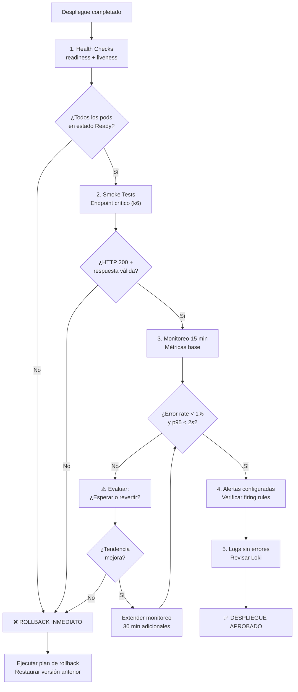

# Guía de Verificación Post-Despliegue

> **Propósito:** Verificar que un despliegue a producción es exitoso mediante smoke tests, monitoreo de métricas y criterios de rollback.
> **Estándares:** RED (Rate, Errors, Duration), USE (Utilization, Saturation, Errors), SLOs.

---

## 1. Flujo de Verificación



## 2. Checklist de Verificación

Cada item DEBE ejecutarse en orden. Si alguno falla, evaluar rollback.

| # | Paso | Herramienta | Criterio | Tiempo estimado |
| :- | :--- | :---------- | :------- | :-------------- |
| 1 | Health Check API | `curl /health` o Grafana | HTTP 200, respuesta < 500ms | 30s |
| 2 | Smoke Test endpoint crítico | k6 (script mínimo) | HTTP 200, body válido | 2 min |
| 3 | Error rate general | Prometheus + Grafana | < 1% sobre total de requests | 5 min |
| 4 | Latencia p95 | Prometheus + Grafana | < 2s (o SLO definido) | 5 min |
| 5 | Throughput esperado | Prometheus + Grafana | ≥ 90% del esperado | 5 min |
| 6 | Logs sin errores inesperados | Grafana Loki | Sin ERRORs no reportados | 5 min |
| 7 | Conexiones BD activas | SQL Server / PostgreSQL monitor | < 80% del pool máximo | 2 min |
| 8 | Cache hit rate | Redis/Memcached metrics | > 80% | 2 min |
| 9 | Alertas configuradas | Prometheus Alertmanager | Sin alertas firing inesperadas | 3 min |
| 10 | Dashboard actualizado | Grafana | Métricas visibles en dashboard | 2 min |

## 3. Script de Verificación (k6 Smoke Test)

```javascript
import http from 'k6/http';
import { check, sleep } from 'k6';

export const options = {
  vus: 1,
  duration: '30s',
  thresholds: {
    http_req_duration: ['p(95)<2000'],
    http_req_failed: ['rate<0.01'],
  },
};

export default function () {
  const res = http.get('https://api.unimar.com/health');
  check(res, {
    'status 200': (r) => r.status === 200,
    'response time < 500ms': (r) => r.timings.duration < 500,
  });
  sleep(1);
}
```

## 4. Criterios de Decisión

| Estado | Condición | Acción |
| :----- | :-------- | :----- |
| ✅ **APROBADO** | Checklist 10/10, métricas estables | Release completo. Notificar al equipo |
| ⚠️ **OBSERVADO** | 1-2 items fallan con tendencia de mejora | Extender monitoreo 30 min. Notificar guardia |
| ❌ **ROLLBACK** | 3+ items fallan o error rate > 5% | Ejecutar rollback inmediato. Incidente documentado |

## 5. Herramientas

| Herramienta | Propósito | Instalación | Uso | Licencia |
| :---------- | :-------- | :---------- | :-- | :------- |
| [k6](https://k6.io/) | Smoke tests + verificación de salud | [instalación](https://k6.io/docs/getting-started/installation/) | [docs](https://k6.io/docs/using-k6/) | AGPL 3.0 (gratuita) / Cloud (paga) |
| [Prometheus](https://prometheus.io/) | Recolección de métricas | [guía](https://prometheus.io/docs/prometheus/latest/installation/) | [docs](https://prometheus.io/docs/introduction/overview/) | Apache 2.0 (gratuita) |
| [Grafana](https://grafana.com/) | Dashboards + alertas | [instalación](https://grafana.com/docs/grafana/latest/setup-grafana/installation/) | [docs](https://grafana.com/docs/grafana/latest/) | AGPL 3.0 (gratuita) / Cloud (paga) |
| [Grafana Loki](https://grafana.com/oss/loki/) | Agregación de logs | [instalación](https://grafana.com/docs/loki/latest/installation/) | [docs](https://grafana.com/docs/loki/latest/) | AGPL 3.0 (gratuita) |
| [Prometheus Alertmanager](https://prometheus.io/docs/alerting/latest/alertmanager/) | Gestión de alertas | [guía](https://prometheus.io/docs/alerting/latest/alertmanager/installation/) | [docs](https://prometheus.io/docs/alerting/latest/alertmanager/) | Apache 2.0 (gratuita) |

---

[Volver a Fase 5 — Entrega y Operaciones](../../../navigation/indices/fase-5-entrega-operaciones.md)
