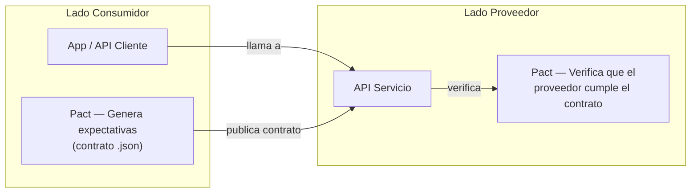
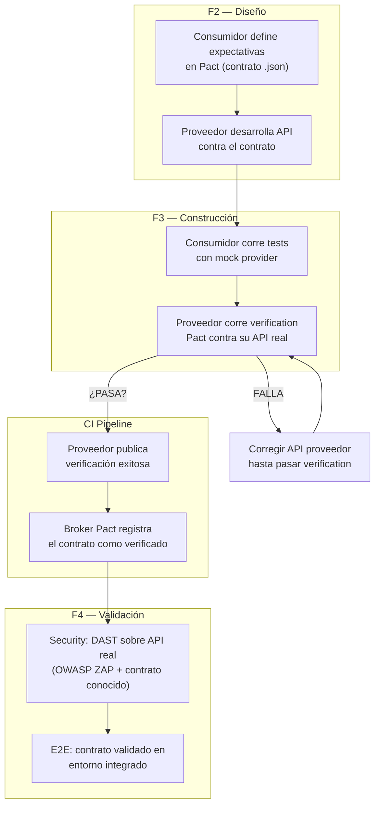

# Guía de Pruebas de Contrato (Contract Testing)

> **Estándares de Referencia:** [Pact](https://pact.io/) (consumer-driven contracts), [OpenAPI 3.1](https://spec.openapis.org/oas/v3.1.0), [AsyncAPI 2.6](https://www.asyncapi.com/docs/reference/specification/v2.6.0), [Protobuf](https://protobuf.dev/) + [gRPC](https://grpc.io/).
> **Propósito:** Garantizar que consumidor y proveedor de un contrato API (REST, gRPC, eventos asíncronos) acuerdan el mismo contrato antes de integrar, previniendo rupturas silenciosas en producción.

---

## 1. ¿Qué son las Pruebas de Contrato?

Validan que un **consumidor** (cliente) y un **proveedor** (servicio) cumplen el mismo contrato de comunicación: mismo formato de request, mismo formato de response, mismos códigos de error, mismos campos obligatorios/opcionales. No prueban lógica de negocio ni comportamiento — solo el **acuerdo de interfaz**.

---

## 2. Propósito

| Aspecto | Detalle |
| :------ | :------ |
| **Propósito** | Detectar rupturas de contrato antes de que afecten a consumidores en producción |
| **¿Cuándo?** | Durante F2 (diseño) y F3 (construcción), antes de integrar servicios |
| **¿Por qué?** | Sin contract testing, un cambio en API puede romper consumidores silenciosamente. Pact detecta la ruptura antes de desplegar |
| **¿Dónde?** | CI pipeline, después de unitarias y antes de E2E |
| **¿Quién?** | Desarrollador del servicio proveedor + Desarrollador del servicio consumidor |

> **Dato:** Las rupturas de contrato representan el [60-80% de los incidentes de integración](https://docs.pact.io/) en arquitecturas de microservicios.

---

## 3. Tipos de Contrato Soportados

| Tipo | Estándar | Herramienta | ¿Cuándo usar? | Relación con Seguridad |
| :--- | :------- | :---------- | :------------ | :--------------------- |
| **REST** | OpenAPI 3.1 + Pact | [Pact JS](https://pact.io/) / [Pact Net](https://github.com/pact-foundation/pact-net) | APIs síncronas entre servicios | Las pruebas de contrato validan autenticación y formato de tokens. Ver [Plan de Seguridad](../testing/plan-seguridad.es.md) |
| **gRPC** | Protobuf | [Pact JS](https://pact.io/) (gRPC plugin) | Comunicación interna de alta performance | Los contratos gRPC definen tipos seguros. Ver SAST en [Estrategia de Seguridad](../../sdlc/estrategia-seguridad.es.md) |
| **Eventos asíncronos** | AsyncAPI 2.6 + Pact | [Pact JS](https://pact.io/) (message pact) | Colas, event bus, Kafka/RabbitMQ | Los eventos no deben exponer datos sensibles. Ver DAST en [Estrategia de Seguridad](../../sdlc/estrategia-seguridad.es.md) |

---

## 4. Flujo de Contract Testing

---

## 5. Reglas por Tipo de Contrato

### REST (OpenAPI 3.1)

| Regla | Descripción | Herramienta |
| :---- | :---------- | :---------- |
| **Versionado semántico** | Breaking changes → major version. Adiciones backward-compatibles → minor. | Pact + OpenAPI diff |
| **Campos obligatorios** | Todo campo en response debe estar documentado en OpenAPI con `required: true/false` | OpenAPI validator |
| **Códigos de error** | Definir códigos 4xx/5xx en el contrato. No retornar 500 para errores de negocio | Pact |
| **Autenticación y Autorización** | El contrato debe incluir headers de autenticación y escenarios 401/403 | Pact + [Plan de Seguridad](../testing/plan-seguridad.es.md) |
| **Rate limiting** | Documentar headers `X-RateLimit-*` y código 429 en el contrato | Pact |

### gRPC (Protobuf)

| Regla | Descripción | Herramienta |
| :---- | :---------- | :---------- |
| **Package naming** | `unimar.<dominio>.<servicio>.v1` | Protobuf compiler |
| **Backward compatibility** | No eliminar campos existentes. Usar `deprecated` en lugar de borrar | `buf breaking` |
| **Tipos seguros** | Usar `google.type.Money`, `google.type.Date` en lugar de primitivos | Protobuf well-known types |
| **Errores estándar** | Usar `google.rpc.Status` con códigos gRPC canónicos | gRPC |
| **TLS mutuo (mTLS)** | Obligatorio para gRPC entre servicios. Validar en contrato | [Plan de Seguridad](../testing/plan-seguridad.es.md) |

### Eventos Asíncronos (AsyncAPI 2.6)

| Regla | Descripción | Herramienta |
| :---- | :---------- | :---------- |
| **Schema registry** | Todo evento debe tener schema en Schema Registry (Avro/JSON Schema) | Schema Registry |
| **Payload mínimo** | El evento debe contener solo los campos que el consumidor necesita | Pact message pact |
| **Idempotencia** | Todo evento debe tener `eventId` único para deduplicación | Pact |
| **No exponer datos sensibles** | Revisar que el payload del evento no contenga PII no autorizada | [Estrategia de Seguridad](../../sdlc/estrategia-seguridad.es.md) §2 (Secret Scanning) |

---

## 6. Integración en CI/CD

| Rama | Acción | Gate |
| :--- | :----- | :--- |
| **feature** | Consumidor: tests con mock provider. Proveedor: verification local | Pact verification pasa |
| **develop** | Proveedor publica verification en Pact Broker | Contrato verificado + SAST pasa |
| **release** | Verificación cruzada: todos los consumidores vs. proveedor real | Todos los contracts PASAN + DAST aprobado |
| **main** | Smoke test + health check del contrato | Health endpoint retorna 200 |

---

## 7. Criterios de Aceptación

| Criterio | Medición | ¿Qué pasa si falla? |
| :------- | :------- | :------------------ |
| **Todo endpoint REST tiene contrato Pact verificado** | Pact Broker | ❌ Bloquea el merge a develop |
| **Breaking change tiene major version** | OpenAPI diff | ❌ Bloquea el merge |
| **gRPC proto no elimina campos existentes** | `buf breaking` | ❌ Bloquea el merge |
| **Eventos asíncronos tienen schema registrado** | Schema Registry | ❌ Bloquea el deploy |
| **No se exponen datos sensibles en contratos** | CodeQL + revisión manual | ❌ Bloquea el RC. Ver [Estrategia de Seguridad](../../sdlc/estrategia-seguridad.es.md) |
| **Autenticación documentada en contrato** | Revisión manual | ⚠️ Se documenta y planifica |

---

## 8. Herramientas

| Herramienta | Tipo | Propósito | Instalación | Uso | Licencia |
| :---------- | :--- | :-------- | :---------- | :-- | :------- |
| [Pact JS](https://pact.io/) | Contract testing | Framework consumer-driven contracts para Node.js | [npm](https://www.npmjs.com/package/@pact-foundation/pact) | [docs](https://docs.pact.io/) | MIT — Open Source |
| [Pact Net](https://github.com/pact-foundation/pact-net) | Contract testing | Framework consumer-driven contracts para .NET | [NuGet](https://www.nuget.org/packages/PactNet) | [docs](https://docs.pact.io/) | MIT — Open Source |
| [Pact Broker](https://docs.pact.io/pact_broker) | Repositorio | Almacena y compara versiones de contratos | [Docker](https://hub.docker.com/r/pactfoundation/pact-broker) | [docs](https://docs.pact.io/pact_broker) | Open Source + SaaS (paga) |
| [buf](https://buf.build/) | Protobuf tools | Linting, breaking change detection, generación de código | [CLI](https://buf.build/docs/installation) | [docs](https://buf.build/docs) | BSR Free (limitado) / Enterprise (paga) |
| [AsyncAPI CLI](https://www.asyncapi.com/tools/cli) | Event schema | Validación de schemas de eventos | [npm](https://www.npmjs.com/package/@asyncapi/cli) | [docs](https://www.asyncapi.com/docs/tools/cli) | Apache 2.0 — Open Source |
| [OpenAPI Diff](https://github.com/OpenAPITools/openapi-diff) | API diff | Detección de breaking changes en OpenAPI | [CLI](https://github.com/OpenAPITools/openapi-diff) | [README](https://github.com/OpenAPITools/openapi-diff) | Apache 2.0 — Open Source |

---

## 9. Relación con Estrategia de Seguridad

Las pruebas de contrato y las pruebas de seguridad se complementan:

| Aspecto del Contrato | Prueba de Contrato | Prueba de Seguridad |
| :------------------- | :----------------- | :------------------ |
| Autenticación | ¿El contrato documenta tokens/API keys? | [DAST](https://www.zaproxy.org/) verifica que la autenticación no sea vulnerable |
| Autorización | ¿El contrato incluye escenarios 403? | Pentest manual verifica [IDOR y privilege escalation](../testing/plan-seguridad.es.md) |
| Rate limiting | ¿El contrato documenta headers 429? | [k6](https://k6.io/) verifica que el rate limit funcione |
| Exposición de datos | ¿El contrato expone solo campos necesarios? | [CodeQL](https://codeql.github.com/) detecta campos PII no autorizados |
| Versiones de API | ¿El contrato tiene versionado semántico? | [OWASP ZAP](https://www.zaproxy.org/) verifica que versiones antiguas no sean accesibles |

> Ver [Estrategia de Pruebas de Seguridad](../../sdlc/estrategia-seguridad.es.md) y [Plan de Pruebas de Seguridad](../testing/plan-seguridad.es.md).

---

## 10. ADRs Relacionados

| ADR | Título | ¿Qué define? |
| :-- | :----- | :----------- |
| ADR-0040 | Selección Multi-Runtime y Contratos | Reglas de tipo-safe entre runtimes |
| ADR-0037 | Estrategia de Rendimiento y Caos | Validación continua bajo carga y fallos |
| ADR-0018 | Pirámide de Pruebas y Gates de Calidad | Distribución 70/20/10 y umbrales |

---

## 11. Documentos Relacionados

| Documento | Propósito |
| :-------- | :-------- |
| [Estrategia de Pruebas](../../sdlc/estrategia-pruebas.es.md) | Hub central de todas las estrategias de prueba |
| [Estrategia de Pruebas de Seguridad](../../sdlc/estrategia-seguridad.es.md) | Flujo paso a paso para pruebas de seguridad |
| [Plan de Pruebas de Seguridad](../testing/plan-seguridad.es.md) | Herramientas, controles y criterios de seguridad |
| [Manifiesto de Ingeniería](./manifiesto-ingenieria.md) | Principios SOLID, DRY, KISS, test-first |

---

Volver a Fase 4 — Validación
