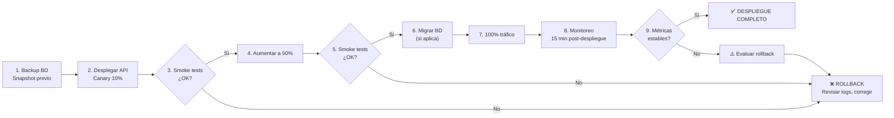

# Plantilla: Plan de Despliegue

> **Propósito:** Documentar el plan de despliegue de un release candidate a producción, incluyendo estrategia, secuencia, rollback y verificación post-despliegue.
> **Estándares:** Blue/Green Deployment, Canary Release, Rolling Update.

---

## 1. Datos del Despliegue

| Campo | Valor |
| :---- | :---- |
| **Producto** | |
| **Versión** | |
| **Fecha planificada** | |
| **Ventana de despliegue** | |
| **Responsable** | |
| **Aprobador** | |

## 2. Alcance

| Componente | Versión actual | Versión destino | Cambio |
| :--------- | :------------- | :-------------- | :----- |
| API Backend | v1.2.0 | v1.3.0 | Minor |
| Web App | v1.2.0 | v1.3.0 | Minor |
| Base de Datos | v1.2.0 | v1.3.0 | Migración |
| Worker (Background) | v1.2.0 | v1.3.0 | Minor |

## 3. Estrategia de Despliegue

| Estrategia | Aplica | Detalle |
| :--------- | :----- | :------ |
| **Blue/Green** | ☐ Sí ☐ No | Entorno idle preparado para conmutación inmediata |
| **Canary** | ☐ Sí ☐ No | % de tráfico inicial: 10%, luego 50%, luego 100% |
| **Rolling Update** | ☐ Sí ☐ No | Batch size: 2 pods, intervalo: 30s |
| **Feature Flag** | ☐ Sí ☐ No | Flag: `release/v1.3.0` |

## 4. Secuencia de Despliegue

## 5. Rollback Plan

| Escenario | Acción | Tiempo estimado |
| :-------- | :----- | :-------------- |
| Smoke test falla | Revertir canary al 0%, restaurar versión anterior | 5 min |
| Error rate > 1% post-despliegue | Activar feature flag `release/v1.3.0 = false` | 2 min |
| p95 latency > 3s | Revertir canary, escalar horizontalmente | 10 min |
| Migración BD falla | Restaurar snapshot pre-despliegue | 15 min |

## 6. Verificación Post-Despliegue

| # | Verificación | Herramienta | Criterio |
| :- | :----------- | :---------- | :------- |
| 1 | Health check API | `GET /health` | HTTP 200 |
| 2 | Smoke test E2E | Playwright / k6 | Todos los tests PASAN |
| 3 | Latencia p95 | Grafana + Prometheus | < 2s |
| 4 | Error rate | Grafana + Prometheus | < 1% |
| 5 | Logs sin errores | Grafana Loki | Sin ERRORs no esperados |
| 6 | BD conectada | Health check DB | Conexión exitosa |
| 7 | Cache warm | Redis | Hit rate > 80% |

## 7. Checklist de Aprobación

- [ ] RC firmado por QA (ver [Reporte de Pruebas](../../sdlc/04-plantillas-artefactos/plantilla-reporte-resumen-pruebas.es.md))
- [ ] Plan de seguridad aprobado (ver [Estrategia de Seguridad](../../sdlc/estrategia-seguridad.es.md))
- [ ] Backups confirmados
- [ ] Rollback plan documentado
- [ ] Runbook actualizado
- [ ] Equipo de guardia notificado
- [ ] Feature flags configuradas

---

## 8. Documentos Relacionados

| Documento | Propósito |
| :-------- | :-------- |
| [Notas de Lanzamiento](../../sdlc/04-plantillas-artefactos/plantilla-notas-lanzamiento.es.md) | Comunicación del release a usuarios |
| [Guía Post-Despliegue](./guia-post-despliegue.es.md) | Verificación y monitoreo posterior al despliegue |
| [Estrategia de Seguridad](../../sdlc/estrategia-seguridad.es.md) | Gates de seguridad para el RC |
| [Estrategia de Pruebas](../../sdlc/estrategia-pruebas.es.md) | Smoke tests post-deploy |

---

[Volver a Fase 5 — Entrega y Operaciones](../../../navigation/indices/fase-5-entrega-operaciones.md)
