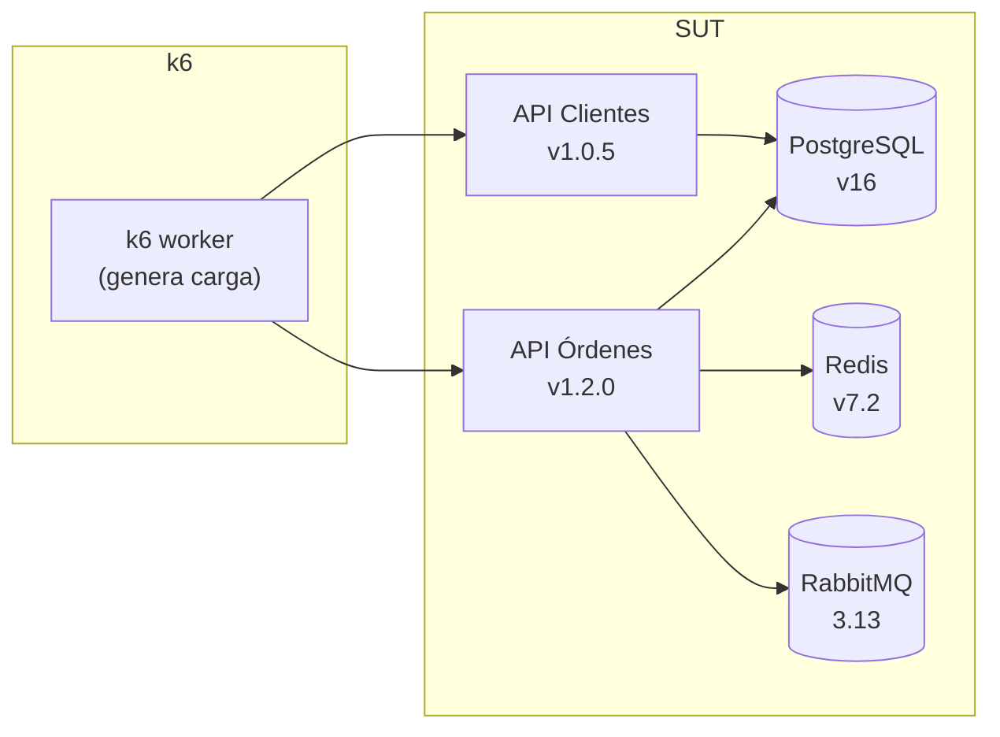
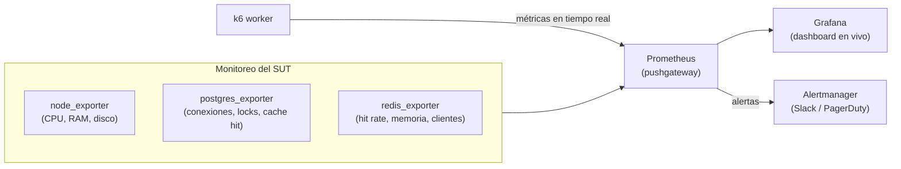
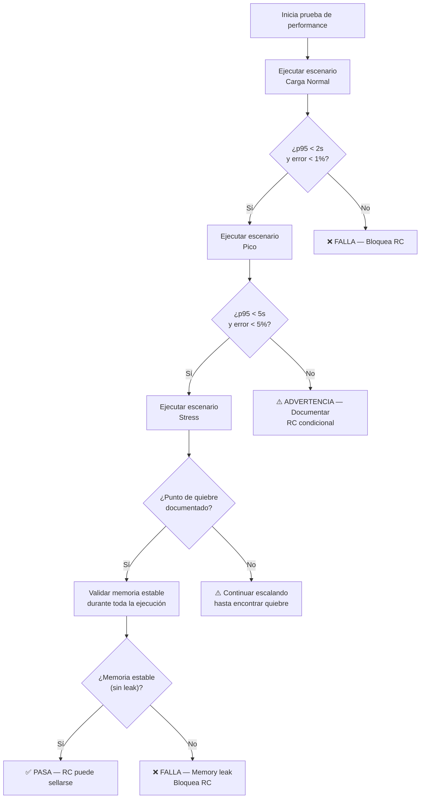

# Plan de Pruebas de Performance

> **Estándares de Referencia:** ISO/IEC 25010:2023 (SQuaRE — Eficiencia de Rendimiento), ISO/IEC 29119-4:2015 (Pruebas de Rendimiento), IEEE 829-2008 (Estructura de Documentación de Pruebas).
> **Herramienta de Evaluación:** [k6](https://k6.io/) v49+ (proyecto [CNCF incubated](https://www.cncf.io/projects/k6/)).
> **Propósito:** Estandarizar la planificación, ejecución y evaluación de pruebas de performance, garantizando condiciones de aceptación claras, trazables y automatizables en CI/CD.

---

## 1. Estructura del Plan de Pruebas de Performance

Todo plan de pruebas de performance DEBE contener las siguientes secciones. Cada sección tiene un propósito específico dentro del estándar ISO/IEC 29119-4.

| Sección | Estándar | Propósito |
| :------ | :------- | :-------- |
| **1. Objetivos** | ISO 25010 — Eficiencia de Rendimiento | Definir qué NFRs se validan (latencia, throughput, concurrencia, estabilidad). |
| **2. Sistema Bajo Prueba (SUT)** | IEEE 829 — Descripción del ítem de prueba | Delimitar alcance: qué servicios, versiones, dependencias. |
| **3. Perfiles de Carga** | ISO 29119-4 — Diseño de pruebas de rendimiento | Modelar el comportamiento esperado de usuarios reales. |
| **4. Métricas y KPIs** | ISO 25010 — Medición de rendimiento | Definir qué se mide y cómo se recolecta. |
| **5. Criterios de Aceptación** | IEEE 829 — Criterios de pase/fallo | Condiciones claras y medibles que determinan si la prueba pasa. |
| **6. Condiciones del Entorno** | IEEE 829 — Necesidades del entorno | Requisitos de infraestructura, datos, herramientas. |
| **7. Ejecución y Cronograma** | IEEE 829 — Plan de ejecución | Cuándo y cómo se ejecuta la prueba. |
| **8. Roles y Responsabilidades** | ISO 29119-1 — Gobernanza | Quién define, ejecuta, analiza y aprueba. |
| **9. Riesgos y Mitigación** | ISO 29119-4 — Riesgos de performance | Qué puede salir mal y cómo se mitiga. |
| **10. Entregables** | IEEE 829 — Deliverables | Reportes, dashboards, evidencias. |

---

## 2. Formato Canónico del Plan

> Instrucciones: Completar cada sección en el repositorio del producto como `docs/planning-artifacts/performance/plan-performance-<producto>-<NNN>.es.md`.

```markdown
---
id: PP-<producto>-<NNN>
producto: <Nombre del producto>
versión: <X.Y.Z>
fecha: <YYYY-MM-DD>
autor: <Nombre>
estado: Borrador | Aprobado | Ejecutado
---

# Plan de Pruebas de Performance: <título>

## 1. Objetivos

| Objetivo | Atributo ISO 25010 | ¿Por qué es importante? |
| :------- | :----------------- | :---------------------- |
| <ej: Validar que el endpoint de creación de órdenes responde en < 2s con 100 usuarios concurrentes> | Comportamiento Temporal (Tiempo de Respuesta) | <ej: El ALB del operador requiere respuesta en < 3s para evitar timeouts> |
| <ej: Verificar que el throughput se mantiene estable durante 30 minutos de carga sostenida> | Capacidad (Throughput) | <ej: La ventana de procesamiento nocturno es de 2 horas> |
| <ej: Comprobar que el sistema se degrada gracefulmente bajo 2x la carga esperada> | Recuperabilidad | <ej: Picos en cierre fiscal multiplican la carga por 3> |

### 1.1 NFRs Asociados

| ID NFR | Descripción | Fuente |
| :----- | :---------- | :----- |
| NFR-PERF-001 | Tiempo de respuesta p95 < 2s en APIs transaccionales | [Matriz NFR](../../../architecture/matriz-nfr-suite.es.md) |
| NFR-PERF-002 | Throughput sostenido ≥ 500 req/s por servicio | [Matriz NFR](../../../architecture/matriz-nfr-suite.es.md) |
| NFR-PERF-003 | Disponibilidad 99.9% en ventana crítica (6am–10pm) | [ADR-0013](../../../architecture/adrs/core/0013-topologia-infraestructura-cloud-dr.es.md) |

---

## 3. Sistema Bajo Prueba (SUT)

| Componente | Versión | Rol en la prueba | Dependencias externas |
| :--------- | :------ | :--------------- | :-------------------- |
| <ej: API de Órdenes> | <1.2.0> | Servicio objetivo | PostgreSQL, Redis, RabbitMQ |
| <ej: API de Clientes> | <1.0.5> | Dependencia aguas arriba | PostgreSQL |
| <ej: RabbitMQ> | <3.13> | Cola de eventos de dominio | — |

### 3.1 Diagrama de Arquitectura Bajo Prueba



---

## 4. Perfiles de Carga

### 4.1 Escenario 1: Carga Normal (Horario Pico)

```javascript
// k6 — Escenario de carga normal (horario pico: 10am–12pm)
export const normalLoad = {
  stages: [
    { duration: '5m', target: 50 },   // ramp-up: simula llegada de usuarios
    { duration: '30m', target: 50 },   // meseta: carga sostenida
    { duration: '5m', target: 0 },     // ramp-down
  ],
  thresholds: {
    http_req_duration: ['p(95)<2000'],
    http_req_failed: ['rate<0.01'],
  },
};
```

| Parámetro | Valor | Justificación |
| :-------- | :---- | :------------ |
| Usuarios concurrentes | 50 | Promedio de usuarios activos en hora pico (analítica de producción) |
| Duración meseta | 30 min | Tiempo suficiente para detectar degradación por memory leak o contención |
| Threshold p95 | < 2s | SLA del producto |

### 4.2 Escenario 2: Pico (Cierre Fiscal)

```javascript
// k6 — Escenario de pico (cierre fiscal: fin de mes)
export const peakLoad = {
  stages: [
    { duration: '2m', target: 50 },    // calentamiento
    { duration: '3m', target: 200 },   // escalada rápida a 200 usuarios
    { duration: '10m', target: 200 },  // meseta en pico
    { duration: '5m', target: 0 },     // descenso
  ],
  thresholds: {
    http_req_duration: ['p(95)<5000'], // SLA degradado aceptable en pico
    http_req_failed: ['rate<0.05'],    // hasta 5% de errores aceptable en pico
  },
};
```

| Parámetro | Valor | Justificación |
| :-------- | :---- | :------------ |
| Usuarios concurrentes | 200 | 4x el promedio histórico de fin de mes |
| Duración meseta | 10 min | Suficiente para estabilizar métricas |
| Threshold p95 | < 5s | SLA degradado aceptable en ventana de pico |
| Error rate | < 5% | Se permite degradación controlada, no caída total |

### 4.3 Escenario 3: Stress (Punto de Quiebre)

```javascript
// k6 — Escenario de stress para encontrar el punto de quiebre
export const stressLoad = {
  stages: [
    { duration: '2m', target: 50 },
    { duration: '2m', target: 100 },
    { duration: '2m', target: 200 },
    { duration: '2m', target: 400 },  // 8x la carga normal
    { duration: '2m', target: 800 },  // 16x la carga normal — ¿quiebre?
    { duration: '2m', target: 0 },
  ],
  thresholds: {
    http_req_duration: ['p(95)<10000'], // umbral laxo: buscamos el quiebre
    http_req_failed: ['rate<0.50'],     // hasta 50% de errores aceptable durante stress
  },
};
```

| Parámetro | Valor | Justificación |
| :-------- | :---- | :------------ |
| Escalada | 50 → 100 → 200 → 400 → 800 | Incrementos de 2x para identificar punto de quiebre exacto |
| Objetivo | Encontrar el límite | Documentar el punto exacto donde el sistema falla |

---

## 5. Métricas y KPIs

| Métrica | Unidad | Cómo se mide en k6 | ISO 25010 |
| :------ | :----- | :----------------- | :-------- |
| **Tiempo de respuesta (p50, p95, p99)** | Milisegundos | `http_req_duration` — percentiles integrados | Comportamiento Temporal |
| **Throughput** | Requests/segundo | `http_reqs` / duración del test | Capacidad |
| **Tasa de error** | % | `http_req_failed` + `Rate` personalizado | Tolerancia a Fallos |
| **Tiempo de conexión** | Milisegundos | `http_req_connecting` | Comportamiento Temporal |
| **Tiempo de espera en cola** | Milisegundos | `http_req_waiting` (TTFB) | Comportamiento Temporal |
| **Uso de CPU del SUT** | % | Monitoreo externo (Prometheus + Grafana) | Utilización de Recursos |
| **Uso de memoria del SUT** | MB | Monitoreo externo (Prometheus + Grafana) | Utilización de Recursos |
| **Conexiones BD activas** | Conteo | `SHOW COUNT(*) FROM pg_stat_activity` (PostgreSQL) | Capacidad |

### 5.1 Dashboard de Monitoreo (k6 + Grafana)



> **Configuración de referencia:** Ver [k6 Output to Prometheus](https://k6.io/docs/results-visualization/prometheus/) y [Grafana Dashboards](https://grafana.com/grafana/dashboards/).

---

## 6. Criterios de Aceptación (Condiciones Claras)

Cada escenario DEBE tener criterios de aceptación explícitos. La prueba PASA solo si TODOS los criterios se cumplen.

### 6.1 Criterios por Escenario

| Escenario | Criterio | Medición en k6 | ¿Qué pasa si falla? |
| :-------- | :------- | :------------- | :------------------ |
| **Carga Normal** | `p95 < 2s` | `thresholds.http_req_duration: ['p(95)<2000']` | NO se sella el RC. El equipo de performance investiga cuello de botella. |
| **Carga Normal** | `error rate < 1%` | `thresholds.http_req_failed: ['rate<0.01']` | NO se sella el RC. Revisar errores 5xx, timeouts, conexiones. |
| **Carga Normal** | `throughput > 500 req/s` | `http_reqs / total_time` en script | ADVERTENCIA. Se documenta como riesgo. Puede sellarse si el equipo acepta el riesgo. |
| **Pico** | `p95 < 5s` | `thresholds.http_req_duration: ['p(95)<5000']` | Se documenta. El RC puede sellarse con plan de mitigación. |
| **Pico** | `error rate < 5%` | `thresholds.http_req_failed: ['rate<0.05']` | Se documenta. El RC puede sellarse con plan de mitigación. |
| **Stress** | Punto de quiebre documentado | Escalada hasta que `http_req_failed > 50%` | No bloquea. Es información para capacity planning. |
| **General** | Sin memory leak | Memoria del SUT estable durante toda la prueba | NO se sella el RC. El memory leak debe corregirse antes de release. |
| **General** | Sin degradación progresiva | p95 no aumenta más de 20% entre el minuto 1 y el minuto N de la meseta | NO se sella el RC. Revisar conexiones BD, pool de hilos, garbage collection. |

### 6.2 Matriz de Decisión



### 6.3 Código k6 con Criterios de Aceptación

```javascript
import { check } from 'k6';
import http from 'k6/http';

export function validateThresholds(metrics) {
  const conditions = [
    {
      name: 'p95 latency < 2s',
      passed: metrics.http_req_duration.p95 < 2000,
      value: `${metrics.http_req_duration.p95}ms`,
    },
    {
      name: 'error rate < 1%',
      passed: (metrics.http_req_failed * 100) < 1.0,
      value: `${(metrics.http_req_failed * 100).toFixed(2)}%`,
    },
    {
      name: 'throughput > 500 req/s',
      passed: metrics.http_reqs > 500,
      value: `${metrics.http_reqs.toFixed(0)} req/s`,
    },
  ];

  console.log('=== Validación de Criterios de Aceptación ===');
  let allPassed = true;
  conditions.forEach((c) => {
    const status = c.passed ? '✅' : '❌';
    console.log(`${status} ${c.name}: ${c.value}`);
    if (!c.passed) allPassed = false;
  });
  console.log(`Resultado global: ${allPassed ? '✅ PASA' : '❌ FALLA'}`);
  return allPassed;
}

export function handleSummary(data) {
  validateThresholds(data.metrics);
  return {
    'stdout': '', // salida en consola
    'resultado-condiciones.json': JSON.stringify({
      fecha: new Date().toISOString(),
      escenario: __ENV.SCENARIO || 'normal',
      condiciones: data.metrics,
      pasa: validateThresholds(data.metrics),
    }),
  };
}
```

---

## 7. Condiciones del Entorno

| Requisito | Especificación Mínima | ¿Por qué? |
| :-------- | :-------------------- | :-------- |
| **Hardware del SUT** | Misma especificación que producción (CPU, RAM, disco) | Sin paridad, los resultados no son representativos |
| **Datos de prueba** | Volumen y distribución similar a producción (> 80% del tamaño real) | BD pequeña da tiempos irreales (caching frío vs caliente) |
| **Red** | Latencia y ancho de banda equivalentes a producción | Diferencias de red distorsionan métricas de tiempo de respuesta |
| **Aislamiento** | Sin otros procesos consumiendo recursos del SUT | Contaminación de métricas |
| **k6 worker** | Misma región/az que los usuarios reales | La latencia de red debe ser realista |

---

## 8. Ejecución y Cronograma

| Hito | Cuándo | Responsable |
| :--- | :----- | :---------- |
| Definición del plan | F2 — Diseño (antes de construir) | Arquitecto / Tech Lead |
| Preparación del entorno | F3 — Construcción (semana 2+) | DevOps |
| Ejecución de escenarios | F4 — Validación (antes del RC) | QA / DevOps |
| Análisis de resultados | F4 — Validación (post-ejecución) | Arquitecto / Tech Lead |
| Decisión de sellado | F4 — Gate RC | Architecture Board |

---

## 9. Roles y Responsabilidades

| Rol | Responsabilidad |
| :-- | :-------------- |
| **Arquitecto** | Define los NFRs y los perfiles de carga. Aprueba el plan. |
| **Tech Lead** | Revisa el plan, asegura que el equipo lo entiende. |
| **DevOps** | Prepara el entorno, configura monitoreo, ejecuta los scripts k6. |
| **QA** | Valida que los criterios de aceptación sean medibles. Documenta resultados. |
| **Architecture Board** | Aprueba el RC basado en el reporte de performance. |

---

## 10. Riesgos y Mitigación

| Riesgo | Probabilidad | Impacto | Mitigación |
| :----- | :----------- | :------ | :--------- |
| Entorno de staging no representa producción | Alta | Alto | Usar mismo hardware, mismos datos, misma red. Si no es posible, documentar la desviación y ajustar thresholds. |
| Datos de prueba insuficientes | Media | Alto | Generar datos sintéticos con scripts de seed que repliquen volumen y distribución de producción. |
| Contaminación de otros procesos en staging | Media | Medio | Dedicar entorno exclusivo durante la ventana de prueba. |
| k6 worker con recursos insuficientes | Baja | Alto | Usar k6 en modo cloud o múltiples workers locales con `--paused` y coordinación. |
| Falsos positivos por red | Media | Medio | Ejecutar desde la misma región/cloud que los usuarios reales. |

---

## 11. Entregables

| Entregable | Contenido | Formato |
| :--------- | :-------- | :------ |
| **Plan de Pruebas de Performance** | Este documento completado | `plan-performance-<producto>-<NNN>.es.md` |
| **Reporte de Ejecución** | Resultados de k6 (JSON + HTML) | `reporte-carga-<producto>-<NNN>.html` |
| **Dashboard de Grafana** | Snapshot del dashboard en vivo | URL o PNG |
| **Resumen Ejecutivo** | Tabla de criterios de aceptación con resultado PASA/FALLA | Incluido en el TSR |

---

## 12. Referencias

| Recurso | Estándar / Fuente |
| :------ | :---------------- |
| [ISO/IEC 25010:2023 — Quality Model](https://www.iso.org/standard/78176.html) | Eficiencia de Rendimiento, Capacidad, Comportamiento Temporal |
| [ISO/IEC 29119-4:2015 — Performance Testing](https://www.iso.org/standard/56737.html) | Diseño de pruebas de rendimiento, métricas |
| [IEEE 829-2008 — Test Documentation](https://ieeexplore.ieee.org/document/4710717) | Estructura del plan de pruebas |
| [k6 Documentation — Thresholds](https://k6.io/docs/using-k6/thresholds/) | Criterios de aceptación en k6 |
| [k6 Documentation — Metrics](https://k6.io/docs/using-k6/metrics/) | Métricas y tipos |
| [Google SRE Handbook — Load Testing](https://sre.google/sre-book/) | SLIs, SLOs, capacity planning |
| [CNCF — k6 Project](https://www.cncf.io/projects/k6/) | Estado de adopción de k6 en la industria |
| [OWASP — Performance Testing](https://owasp.org/www-project-web-security-testing-guide/) | Pruebas de performance orientadas a seguridad |

---

Volver a Estrategia de Pruebas
