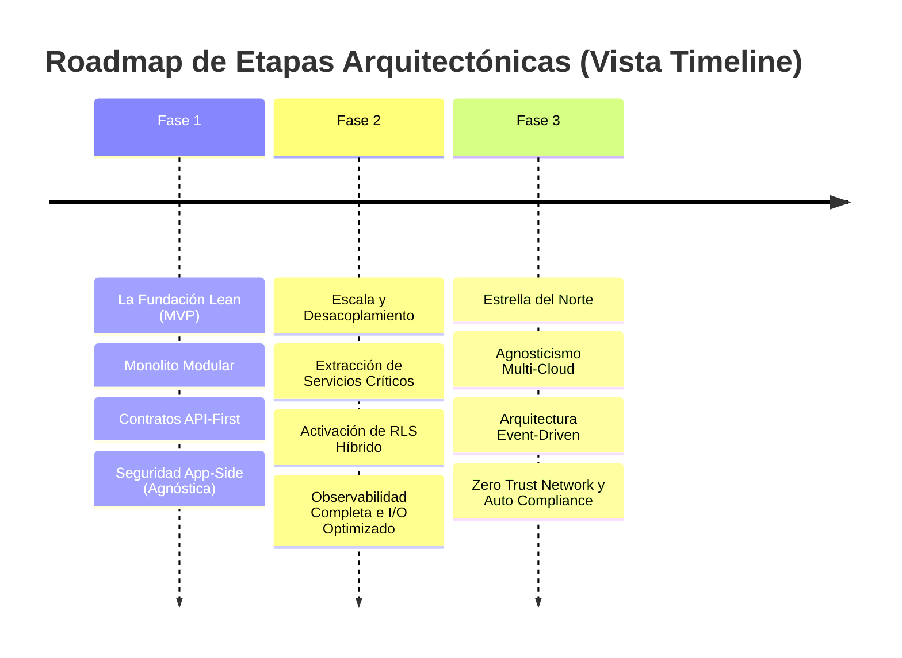

# Estrategia Evolutiva y Roadmap Arquitectónico

<p align="right">
  
  
  
  
</p>

Este documento establece el **roadmap estratégico** — la evolución técnica por fases desde una arquitectura modular fundacional hasta una plataforma global altamente resiliente y agnóstica de proveedor.

---

## 1. Visión y Pilares Técnicos

Nuestra visión central declara que **la Infraestructura es un Detalle de Implementación**, asegurando el control soberano sobre las Reglas de Negocio Centrales.

* **Arquitectura Central:** Hexagonal (Puertos y Adaptadores). El Dominio está centralizado, completamente aislado de las capas de persistencia y frameworks.
* **Prioridad Absoluta:** Desacoplamiento agresivo. Atar la lógica de aplicación a sintaxis específica de un proveedor cloud está estrictamente prohibido.
* **Seguridad Dinámica:** Aprovechando el selector `SECURITY_STRATEGY_MODE` para ajustar la lógica de aislamiento según las capacidades del runtime objetivo.
* **Cumplimiento Nativo:** Gobernado desde el día uno por estrictas restricciones de soberanía GDPR y el estándar regulatorio ISO/IEC 27001:2022.

---

## 2. Roadmap de Etapas Evolutivas



### Fase 1: La Fundación Lean (MVP) — Corto Plazo
**Foco:** Time-to-Market con Integridad de Dominio sin Compromisos.

| Dimensión | Estrategia |
| :--- | :--- |
| **Arquitectura** | Monolito Modular con fronteras fuertemente aplicadas ([ADR-0047](../../../architecture/adrs/core/0047-patrones-arquitectonicos-monolito-soa-microservicios.es.md)). |
| **Persistencia** | Instancia relacional única. Seguridad aplicada del lado de la aplicación (`APP_AGNOSTIC`). |
| **Foco Crítico** | Definición rígida de contratos API-First y validación comprensiva de reglas de negocio centrales sin ruido de infraestructura. |

### Fase 2: Escala y Desacoplamiento — Mediano Plazo
**Foco:** Eficiencia Operacional y Segregación de Componentes.

| Dimensión | Estrategia |
| :--- | :--- |
| **Arquitectura** | Extracción selectiva de componentes críticos disparada por métricas cuantitativas ([ADR-0045](../../../architecture/adrs/core/0045-criterios-extraccion-microservicios.es.md)). |
| **Persistencia** | Activación del Modo Híbrido. Despliegue de RLS nativo (`INFRA_NATIVE`) a producción para velocidad de base de datos, manteniendo fallbacks seguros del código base para suites de test harness. |
| **Foco Crítico** | Observabilidad comprensiva (trazado distribuido + logs estructurados) y reducción agresiva de la latencia de persistencia I/O. |

### Fase 3: Estrella del Norte (Resiliencia y Soberanía) — Largo Plazo
**Foco:** Agnosticismo Cloud Total y Soberanía de Datos Endurecida.

| Dimensión | Estrategia |
| :--- | :--- |
| **Arquitectura** | Orquestación Multi-Cloud completa sobre una robusta Arquitectura Event-Driven (EDA). |
| **Persistencia** | Capacidad de cambiar proveedores de persistencia cloud en tiempo récord (< 24h). Abstracción total. |
| **Foco Crítico** | Networking Zero-Trust absoluto y Compliance-as-Code automatizado integrado en cada pull request del Pipeline CI. |

---

## 3. Dashboard de Observabilidad y KPIs (Métricas Arquitectónicas)

Para asegurar cero deriva estructural en el tiempo, cada fase se mide mediante ecuaciones determinísticas estrictas.

### 3.1 Índice de Agnosticismo ($PI$)
Cuantifica el desacoplamiento saludable versus las fugas de lógica hacia capas de infraestructura desordenadas.

```math
PI = \frac{\text{Líneas de Código (Dominio + App)}}{\text{Líneas de Código (Infraestructura)}}
```

* **Objetivo:** Crecimiento o estabilidad absoluta en el tiempo. Una puntuación decreciente advierte de fugas hacia persistencia o frameworks.
* **Ejemplo Práctico:**
 * Código de Lógica de Negocio: 10,000 líneas.
 * Código de Persistencia/Infra: 2,000 líneas.
 * **PI Actual:** $10,000 / 2,000 = 5.0$ (Estado saludable). Si cae a 2.0, se activa una revisión urgente de aislamiento.

### 3.2 Delta de Rendimiento de Seguridad ($\Delta P$)
Rastrea el delta de latencia relativo observado entre la capa de aplicación y la contención aplicada por hardware.

```math
\Delta P = P95_{\text{APP\_AGNOSTIC}} - P95_{\text{INFRA\_NATIVE}}
```

* **Objetivo:** Penalización de latencia percentil inferior al 15% al ejecutar la ruta Agnóstica.
* **Ejemplo Práctico:**
 * Modo RLS Nativo: 40ms de respuesta de lectura.
 * Modo App Agnóstica: 45ms de respuesta de lectura.
 * **Impacto:** Aumento de 5ms (+12.5%). **APROBADO** (Umbral bajo 15%).

### 3.3 Tiempo Medio de Migración (MTTM)
Esfuerzo objetivo evaluado al transicionar o intercambiar en caliente un componente de infraestructura fundacional.

* **Objetivo:** Bajo 24 horas-hombre de esfuerzo total transcurrido para servicios primarios al entrar en Fase 3.
* **Ejemplo Práctico:** Un equipo concentrado de 3 ingenieros de staff ejecuta un swap completo de adaptador de TypeORM a Drizzle dentro de un único día laboral compartido de 8 horas (8h x 3 = 24h de esfuerzo total).

### 3.4 Ratio de Deuda Técnica Planeada ($RTD$)
Protege la estabilidad del núcleo de código contra la velocidad agresiva de features externos del producto.

```math
RTD = \frac{\text{Tickets de Refactorización}}{\text{Tickets de Features}}
```

* **Objetivo:** Retener una banda de capacidad constante del 20% dedicada exclusivamente a disciplina sanitaria continua.
* **Ejemplo Práctico:** Por cada 10 Historias de Usuario completadas dentro de un ciclo de entrega, el squad completa al menos 2 tickets de Refactorización (`tech-debt`) dirigidos a limpieza fundacional.

---

## 4. Manifiesto de Principios y No Negociables

Para prevenir la decadencia evolutiva, las siguientes barreras se implementan globalmente:

1. **Cero Lógica de Negocio en BD:** El uso de *Stored Procedures* o *Triggers* que vehiculicen lógica de Reglas de Negocio está estrictamente prohibido (la base de datos solo sirve almacenamiento de estado persistente).
2. **Persistencia Ciega:** El módulo de dominio tiene prohibido importar librerías de persistencia, entidades ORM o anotaciones SQL crudas.
3. **Seguridad de Contrato Inmutable:** Una vez que un payload gRPC o Protobuf aterriza en el registro, las modificaciones que rompan compatibilidad hacia atrás no pueden ejecutarse sin protocolos explícitos de incremento de Versionado Mayor de API.

---

## 5. Estrategia de Cumplimiento y Resiliencia Operacional

### Mapeo de Controles ISO 27001 por Entorno

| Control | Despliegue AWS / Azure | Solución On-Premise / Híbrida |
| :--- | :--- | :--- |
| **A.8.1.3 (Activos)** | Azure Policy / restricciones de región IAM para satisfacer la soberanía legal de datos. | Hardening a nivel de rack detrás de NGFWs perimetrales air-gapped. |
| **A.10.1.1 (Cripto)** | Cifrado KMS nativo respaldado por Customer Managed Keys (CMK). | Clusters de HashiCorp Vault integrados con archivos de cinta offline air-gapped. |

### Protocolo de Rollback Operacional (Activación RLS)
Ante picos críticos de regresión de rendimiento observados durante el switchover a `INFRA_NATIVE`:
1. **Disparador:** La latencia P95 supera el 200% de la línea base histórica de siete días establecida.
2. **Acción:** Conmutación remota del Feature Flag `SECURITY_STRATEGY_MODE` de vuelta a `APP_AGNOSTIC` a través del Central Feature Dashboard (ver ADR-0060).
3. **Efecto:** Duración de propagación < 5 segundos. El sistema absorbe la lógica de evaluación de vuelta a los búferes de pod de memoria de alto cómputo de la aplicación, liberando instantáneamente la carga del cuello de botella de base de datos.

---

<p align="center">
  
  
</p>

<p align="center">
  <strong>© Unimar S.A.</strong> · RUC 20100412447 · Operador Logístico Aduanero desde 1978<br>
  Última revisión: 2026-06-05
</p>
