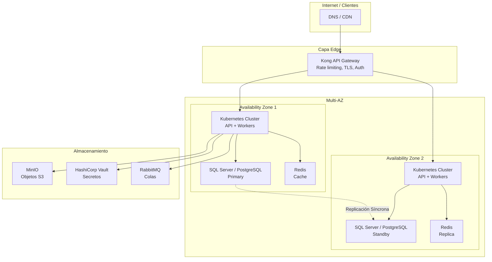

# Hub de Infraestructura

> **Meta:** Especificaciones de plataforma local, gateway, contenedores y activos de infraestructura para productos Unimar.
> **Objetivos:** (1) Definir la topología cloud y estrategia de disaster recovery, (2) documentar escenarios multi-cloud, (3) estandarizar el aprovisionamiento y la configuración de red.

Hub padre: [`../README.md`](../README.md).

---

<strong>Topología de Referencia</strong>

---

<strong>Componentes de Infraestructura</strong>

| Componente | Tecnología | Propósito | Alternativa | DR |
| :--------- | :--------- | :-------- | :---------- | :- |
| **Orquestación** | Kubernetes (K8s) | Contenedores en producción | — | Multi-AZ |
| **API Gateway** | Kong OSS | Borde, rate limiting, auth | — | Activo-pasivo |
| **BD .NET** | SQL Server | Persistencia relacional | PostgreSQL (con ADR) | Always On Availability Group |
| **BD Node.js** | PostgreSQL | Persistencia relacional | MongoDB (NoSQL) | Streaming Replication |
| **Cache** | Redis | Cache, sesiones, rate limiting | — | Sentinel / Cluster |
| **Colas** | RabbitMQ | Mensajería AMQP, DLQ | Kafka (streaming) | Mirrored Queues |
| **Secretos** | HashiCorp Vault | Credenciales, certificados | — | Vault HA + DR |
| **Objetos** | MinIO (S3) | Almacenamiento de objetos | AWS S3 | MinIO Bucket Replication |
| **Logs** | Grafana Loki | Logs estructurados | — | Loki (configurable) |
| **Métricas** | Prometheus + Grafana | Métricas y dashboards | Mimir | Thanos / Mimir |

---

<strong>Estrategia de Disaster Recovery</strong>

| Escenario | RTO | RPO | Estrategia |
| :-------- | :-: | :-: | :--------- |
| **Pérdida de un pod** | < 1 min | 0 | Kubernetes rescheduler automático |
| **Caída de un nodo** | < 5 min | 0 | Multi-AZ, pods redistribuidos |
| **Caída de AZ completa** | < 15 min | < 5 min | Failover a AZ2 manual o automático |
| **Corrupción de datos** | < 60 min | < 24 h | Restaurar backup diario |
| **Desastre regional** | < 4 h | < 1 h | DR site en región secundaria |

### Requisitos de Backup

| Componente | Frecuencia | Retención | Tipo |
| :--------- | :--------- | :-------- | :--- |
| SQL Server | Completa: diaria / Log: cada 15 min | 30 días | Full + Differential + T-Log |
| PostgreSQL | Completa: diaria / WAL: streaming | 30 días | pg_dump + pgBackRest |
| Redis | Snapshot (RDB): cada 5 min | 2 días | RDB + AOF |
| MinIO | Bucket replication continua | 30 días | S3 versioning + replication |
| Vault | Snapshot diario | 90 días | Vault DR snapshot |
| Manifiestos K8s | Por deploy | Indefinido | Git (IaC) |

---

<strong>Documentos</strong>

| Documento | Tipo | Propósito |
| :-------- | :--- | :-------- |
| [ADR-0013 — Topología Cloud y DR](../architecture/adrs/core/0013-topologia-infraestructura-cloud-dr.es.md) | Decisión | Topología multi-AZ y disaster recovery |
| [ADR-0028 — Infraestructura Híbrida Autogestionada](../architecture/adrs/core/0028-infraestructura-hibrida-autogestionada.es.md) | Decisión | On-premise o cloud híbrida |
| [ADR-0047 — Estrategia de Caché Distribuida](../architecture/adrs/core/0014-estrategia-cache-distribuido-redis.es.md) | Decisión | Redis en producción |
| [ADR-0051 — Estrategia de Motor de Base de Datos](../architecture/adrs/core/0051-estrategia-motor-base-datos-empresarial.es.md) | Decisión | SQL Server, PostgreSQL, MongoDB por runtime |
| ADR-0054 — Diseño y Normalización de BD | Decisión | 3NF para SQL, Design-for-Access para NoSQL |
| [Escenarios de Despliegue Multi-Cloud](../architecture/escenarios-despliegue-multinube.es.md) | Estándar | Escenarios multi-cloud |

---

> **Nota:** Este directorio está preparado para albergar diagramas de red, configuración de gateways, pipelines de CI/CD de infraestructura y scripts de aprovisionamiento.

  <strong>© Unimar S.A.</strong> · RUC 20100412447 · Operador Logístico Aduanero desde 1978 
  Última revisión: 2026-06-11

