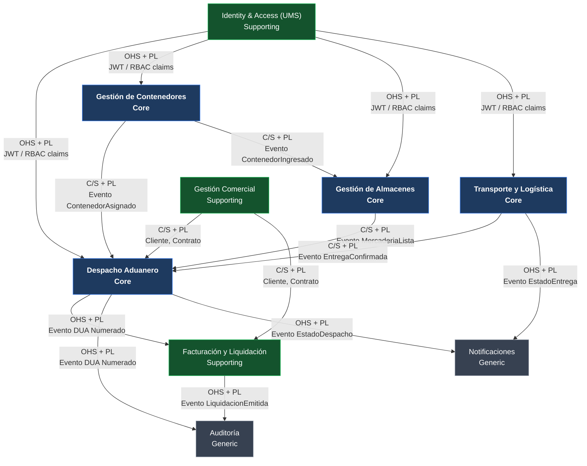

# Ejemplo: Mapa de Contextos Acotados — Suite UNIMAR

  
  
  
  

> **Producto:** Suite de Sistemas de Soporte Operativo — UNIMAR S.A.
> **Fase SDLC:** 2 — Diseño y Arquitectura
> **Padre:** [Mapa de Contextos Acotados](../contextos-acotados.md)
> **Audiencia:** Architecture Board, Tech Leads, Product Owners

---

## Mapa de Contextos — Suite UNIMAR

### Diagrama de Relaciones

---

### Catálogo de Contextos

---

#### Despacho Aduanero — Core

**Lenguaje Ubicuo:**

* **DUA**: Declaración Única de Aduanas — documento oficial que formaliza la operación ante SUNAT.
* **Despacho**: el proceso completo de importación o exportación de una mercadería, desde el ingreso hasta la numeración del DUA.
* **Régimen Aduanero**: modalidad bajo la cual se realiza el despacho (importación definitiva, exportación definitiva, admisión temporal, etc.).
* **Levante**: autorización de SUNAT que libera la mercadería para salir del almacén o depósito.

**Responsabilidades:**

* Gestionar el ciclo de vida completo del despacho aduanero: creación, numeración de DUA, canal de control (verde/naranja/rojo), levante.
* Coordinar con SUNAT mediante integración con SINTAD/MANIFIESTOS.
* Aplicar reglas arancelarias, restricciones de mercancía y regímenes especiales.
* Publicar el evento `DespachoNumerado` con el número de DUA al cierre exitoso.
* Publicar el evento `LevanteConcedido` cuando SUNAT autoriza el retiro de mercadería.

**Lo que NO hace:**

* No gestiona el cobro de la liquidación (→ Facturación y Liquidación).
* No controla el stock físico en el almacén (→ Gestión de Almacenes).
* No asigna el transporte de retiro (→ Transporte y Logística).

**Relaciones con otros contextos:**

| Contexto relacionado | Patrón | Dirección | Contrato |
|---|---|---|---|
| Identity & Access (UMS) | OHS + PL | Upstream → | JWT con claims `sucursales_autorizadas`, `roles` y `permisos` |
| Gestión Comercial | C/S + PL | Upstream → | REST `GET /clientes/{id}`, `GET /contratos/{id}` |
| Gestión de Contenedores | C/S + PL | Upstream → | Evento `ContenedorAsignado` con `contenedor_id`, `bl_numero` |
| Gestión de Almacenes | C/S + PL | Upstream → | Evento `MercaderiaLista` con `almacen_id`, `ubicacion` |
| Transporte y Logística | C/S + PL | Upstream → | Evento `EntregaConfirmada` con `guia_remision` |
| Facturación y Liquidación | OHS + PL | → Downstream | Evento `DespachoDUANumerado` con `dua_numero`, `valor_cif`, `tributos` |
| Auditoría | OHS + PL | → Downstream | Evento `AccionDespacho` con actor, timestamp, acción y payload |
| Notificaciones | OHS + PL | → Downstream | Evento `EstadoDespachoActualizado` con `despacho_id`, estado, mensaje |

**Schema de base de datos:** `despacho`

**Módulo NestJS / proyecto Nx:** `apps/despacho-aduanero`

**Equipo responsable:** Equipo Core Aduanero

---

#### Gestión de Contenedores — Core

**Lenguaje Ubicuo:**

* **Contenedor**: unidad de carga intermodal (TEU/FEU) identificada por número ISO 6346.
* **BL (Bill of Lading)**: documento de embarque marítimo que identifica la carga y su propietario.
* **ETA**: fecha estimada de arribo de la nave al puerto.
* **Transferencia**: movimiento de un contenedor de una sucursal (depósito/patio) a otra.

**Responsabilidades:**

* Registrar el ciclo de vida del contenedor: arribo, descarga, ingreso a patio, transferencia entre sucursales, retiro.
* Gestionar el número ISO, tipo, tara, estado físico y posición en patio.
* Registrar la sucursal (`sucursal_id`) actual del contenedor en cada movimiento.
* Publicar `ContenedorIngresado`, `ContenedorTransferido`, `ContenedorRetirado`.
* Permitir transferencias cross-sucursal con autorización del usuario — `sucursal_id` es un atributo de operación, no un muro de aislamiento ([ADR-0010](../../../architecture/adrs/core/0010-estrategia-arquitectura-multitenant.es.md)).

**Lo que NO hace:**

* No gestiona la carga dentro del contenedor (inventario de mercadería → Gestión de Almacenes).
* No numera ni gestiona el DUA (→ Despacho Aduanero).
* No asigna el camión de retiro (→ Transporte y Logística).

**Relaciones con otros contextos:**

| Contexto relacionado | Patrón | Dirección | Contrato |
|---|---|---|---|
| Identity & Access (UMS) | OHS + PL | Upstream → | JWT con `sucursales_autorizadas` para validar transferencias |
| Despacho Aduanero | C/S + PL | → Downstream | Evento `ContenedorAsignado` con `contenedor_id`, `bl_numero`, `despacho_id` |
| Gestión de Almacenes | C/S + PL | → Downstream | Evento `ContenedorIngresado` disparando recepción de mercadería |
| Auditoría | OHS + PL | → Downstream | Evento `MovimientoContenedor` con actor, sucursal_origen, sucursal_destino |

**Schema de base de datos:** `contenedores`

**Módulo NestJS / proyecto Nx:** `apps/gestion-contenedores`

**Equipo responsable:** Equipo Core Operativo

---

#### Gestión de Almacenes — Core

**Lenguaje Ubicuo:**

* **Almacén Aduanero**: instalación autorizada por SUNAT para custodiar mercadería bajo control aduanero.
* **Ubicación**: posición física dentro del almacén (nave, fila, columna, nivel).
* **Aforo**: inspección física de la mercadería ordenada por SUNAT (canal rojo).
* **Precinto**: dispositivo de seguridad que garantiza integridad de la carga.

**Responsabilidades:**

* Gestionar el ingreso, almacenamiento y retiro de mercadería en depósitos y almacenes.
* Controlar ubicaciones físicas, capacidad y condiciones especiales (refrigerado, peligroso).
* Coordinar el aforo físico con los inspectores de SUNAT.
* Publicar `MercaderiaLista` cuando la mercadería está disponible para levante.

**Lo que NO hace:**

* No gestiona el contenedor que la transporta (→ Gestión de Contenedores).
* No autoriza el retiro aduanero (→ Despacho Aduanero para el levante).

**Relaciones con otros contextos:**

| Contexto relacionado | Patrón | Dirección | Contrato |
|---|---|---|---|
| Identity & Access (UMS) | OHS + PL | Upstream → | JWT con roles de almacenero, jefe de patio |
| Gestión de Contenedores | C/S + PL | Upstream → | Evento `ContenedorIngresado` con `contenedor_id`, `sucursal_id` |
| Despacho Aduanero | OHS + PL | → Downstream | Evento `MercaderiaLista` con `almacen_id`, `ubicacion`, `precinto` |
| Auditoría | OHS + PL | → Downstream | Evento `AccionAlmacen` con actor, tipo de movimiento, timestamp |

**Schema de base de datos:** `almacenes`

**Módulo NestJS / proyecto Nx:** `apps/gestion-almacenes`

**Equipo responsable:** Equipo Core Operativo

---

#### Transporte y Logística — Core

**Lenguaje Ubicuo:**

* **Guía de Remisión**: documento SUNAT que ampara el traslado físico de mercadería.
* **Orden de Transporte**: instrucción interna que asigna un vehículo y conductor a un retiro.
* **Ventana de Retiro**: horario acordado con el cliente para el retiro de su carga.

**Responsabilidades:**

* Gestionar órdenes de transporte: asignación de vehículo, conductor, ruta y horario.
* Emitir y controlar Guías de Remisión.
* Registrar la entrega confirmada y publicar `EntregaConfirmada` con la firma del receptor.
* Gestionar incidentes de ruta (desvío, accidente, robo).

**Lo que NO hace:**

* No realiza el despacho aduanero previo al retiro (→ Despacho Aduanero).
* No factura el servicio de transporte (→ Facturación y Liquidación).

**Relaciones con otros contextos:**

| Contexto relacionado | Patrón | Dirección | Contrato |
|---|---|---|---|
| Identity & Access (UMS) | OHS + PL | Upstream → | JWT con rol de despachador, conductor |
| Despacho Aduanero | OHS + PL | → Downstream | Evento `EntregaConfirmada` con `guia_remision`, firma digital receptor |
| Notificaciones | OHS + PL | → Downstream | Evento `EstadoEntregaActualizado` para alertar al cliente |
| Auditoría | OHS + PL | → Downstream | Evento `AccionTransporte` con actor, vehículo, ruta |

**Schema de base de datos:** `transporte`

**Módulo NestJS / proyecto Nx:** `apps/transporte-logistica`

**Equipo responsable:** Equipo Core Operativo

---

#### Gestión Comercial — Supporting

**Lenguaje Ubicuo:**

* **Cliente**: empresa o persona natural con contrato de servicios aduaneros activo con UNIMAR.
* **Contrato**: acuerdo marco que define tarifas, condiciones de servicio y sucursales habilitadas.
* **Tarifa**: precio acordado por tipo de servicio (almacenaje, despacho, transporte).

**Responsabilidades:**

* Mantener el maestro de clientes y contratos (CRM interno).
* Gestionar tarifas vigentes por tipo de servicio y sucursal.
* Proveer datos de cliente y contrato a contextos operativos vía API.

**Lo que NO hace:**

* No gestiona la ejecución operativa de los servicios (→ contextos Core).
* No emite facturas (→ Facturación y Liquidación, que consume los datos de contrato).

**Relaciones con otros contextos:**

| Contexto relacionado | Patrón | Dirección | Contrato |
|---|---|---|---|
| Despacho Aduanero | C/S + PL | → Downstream | REST `GET /clientes/{id}`, `GET /contratos/{id}` (Open Host Service) |
| Facturación y Liquidación | C/S + PL | → Downstream | REST `GET /tarifas`, `GET /contratos/{id}/condiciones-pago` |

**Schema de base de datos:** `comercial`

**Módulo NestJS / proyecto Nx:** `apps/gestion-comercial`

**Equipo responsable:** Equipo de Producto Comercial

---

#### Identity & Access (UMS) — Supporting

**Lenguaje Ubicuo:**

* **Operador**: usuario interno de UNIMAR con acceso al sistema.
* **Rol**: conjunto de permisos que define qué puede hacer un operador.
* **Sucursal Autorizada**: sucursal sobre la que el operador tiene permiso de operar.
* **Permiso**: acción específica del sistema (ej. `despacho:numerarDUA`, `contenedor:transferir`).

**Responsabilidades:**

* Gestionar el ciclo de vida de operadores: alta, baja, cambio de rol.
* Emitir JWTs con claims `roles`, `permisos` y `sucursales_autorizadas`.
* Exponer el grafo de autorización RBAC/ABAC para consultas de política.
* Auditar todos los eventos de autenticación y cambio de permisos.

**Lo que NO hace:**

* No gestiona clientes externos (→ Gestión Comercial).
* No aplica las reglas de negocio de cada contexto — solo provee la identidad y los claims.

**Relaciones con otros contextos:**

| Contexto relacionado | Patrón | Dirección | Contrato |
|---|---|---|---|
| Todos los contextos Core | OHS + PL | → Downstream | JWT firmado con `RS256`; endpoint `GET /.well-known/jwks.json` para verificación |
| Auditoría | OHS + PL | → Downstream | Evento `EventoAutenticacion` con `user_id`, timestamp, resultado |

**Schema de base de datos:** `auth`

**Módulo NestJS / proyecto Nx:** `apps/ums`

**Equipo responsable:** Equipo de Plataforma

---

#### Facturación y Liquidación — Supporting

**Lenguaje Ubicuo:**

* **Liquidación**: documento de cobro que detalla los servicios prestados y los tributos aduaneros pagados a nombre del cliente.
* **Nota de Crédito / Débito**: ajuste sobre una liquidación emitida.
* **Tributos**: aranceles, IGV y percepciones pagados a SUNAT en nombre del cliente.

**Responsabilidades:**

* Generar liquidaciones a partir de los eventos de cierre de despacho.
* Calcular el fee de UNIMAR sobre la operación según el contrato del cliente.
* Emitir comprobantes de pago electrónicos a SUNAT (SOAP/REST SUNAT).
* Gestionar notas de crédito y débito por ajustes.

**Lo que NO hace:**

* No numera DUAs ni interactúa con SUNAT aduaneramente (→ Despacho Aduanero).
* No gestiona el contrato del cliente (→ Gestión Comercial).

**Relaciones con otros contextos:**

| Contexto relacionado | Patrón | Dirección | Contrato |
|---|---|---|---|
| Despacho Aduanero | C/S + PL | Upstream → | Evento `DespachoDUANumerado` con `dua_numero`, `valor_cif`, `tributos` |
| Gestión Comercial | C/S + PL | Upstream → | REST `GET /contratos/{id}/condiciones-pago`, tarifas |
| Auditoría | OHS + PL | → Downstream | Evento `LiquidacionEmitida` con `liquidacion_id`, `cliente_id`, `monto` |

**Schema de base de datos:** `facturacion`

**Módulo NestJS / proyecto Nx:** `apps/facturacion-liquidacion`

**Equipo responsable:** Equipo de Producto Comercial

---

#### Auditoría — Generic

**Lenguaje Ubicuo:**

* **Entrada de Auditoría**: registro inmutable de una acción ejecutada en el sistema (quién, qué, cuándo, sobre qué).

**Responsabilidades:**

* Recibir y persistir eventos de auditoría de todos los contextos.
* Proveer consultas de historial de acciones por entidad, actor, sucursal y rango de fechas.
* Garantizar inmutabilidad: no se permiten UPDATE ni DELETE sobre las entradas ([ADR-0016](../../../architecture/adrs/core/0016-pista-auditoria-inmutable-negocio.es.md)).

**Lo que NO hace:**

* No ejecuta ninguna lógica de negocio — es un listener pasivo de eventos.

**Relaciones con otros contextos:**

| Contexto relacionado | Patrón | Dirección | Contrato |
|---|---|---|---|
| Todos los contextos | CF | Upstream → | Evento `AccionDominio` estandarizado: `{actor, sucursal_id, entidad, accion, payload, timestamp}` |

**Schema de base de datos:** `auditoria`

**Módulo NestJS / proyecto Nx:** `libs/auditoria` (librería compartida, no app independiente en Fase 1)

**Equipo responsable:** Equipo de Plataforma

---

#### Notificaciones — Generic

**Lenguaje Ubicuo:**

* **Notificación**: mensaje proactivo enviado a un operador o cliente informando el cambio de estado de una operación.
* **Canal**: medio de entrega (correo electrónico, SMS, push móvil, webhook).

**Responsabilidades:**

* Recibir eventos de los contextos Core y traducirlos en mensajes para operadores o clientes.
* Gestionar plantillas de mensaje por tipo de evento y canal.
* Registrar el estado de entrega de cada notificación (enviado, fallido, reintentado).

**Lo que NO hace:**

* No genera ni modifica los eventos de dominio que originan las notificaciones.

**Relaciones con otros contextos:**

| Contexto relacionado | Patrón | Dirección | Contrato |
|---|---|---|---|
| Despacho Aduanero | CF | Upstream → | Evento `EstadoDespachoActualizado` |
| Transporte y Logística | CF | Upstream → | Evento `EstadoEntregaActualizado` |

**Schema de base de datos:** `notificaciones`

**Módulo NestJS / proyecto Nx:** `libs/notificaciones` (librería compartida en Fase 1)

**Equipo responsable:** Equipo de Plataforma

---

## Decisiones Pendientes

* [ ] Definir si Gestión Comercial (CRM) se construye internamente o se reemplaza con un SaaS (HubSpot, Salesforce) — actualmente clasificado como Supporting pero podría moverse a Generic.
* [ ] Confirmar si Facturación y Liquidación requiere extracción temprana a microservicio independiente dado el alto volumen de comprobantes electrónicos SUNAT.
* [ ] Definir el patrón de integración con SINTAD (sistema de SUNAT para despachos) — candidato a ACL.

---

## Historial de Revisiones

| Fecha | Cambio | Responsable |
|---|---|---|
| 2026-06-08 | Versión inicial — 8 contextos de la suite UNIMAR | Architecture Board |

---

  
  

  <strong>© Unimar S.A.</strong> · RUC 20100412447 · Operador Logístico Aduanero desde 1978 
  Última revisión: 2026-06-08

