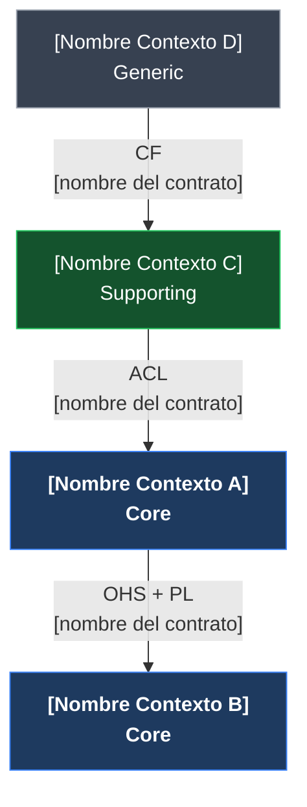

# Contextos Acotados — Fuente Reutilizable

> **Propósito:** Fuente reutilizable para mapear los bounded contexts de un producto o módulo de UNIMAR.
> **Fase SDLC:** 1 — Concepción y Descubrimiento / 2 — Diseño y Arquitectura
> **Responsable:** Arquitecto de Solución + Product Owner
> **Puerta de salida:** Baseline de Diseño Aprobado

---

## Mapa de Contextos — [Nombre del Producto / Suite]

### Diagrama de Relaciones

---

### Catálogo de Contextos

---

#### [Nombre del Contexto] — Core | Supporting | Generic

**Lenguaje Ubicuo:** [Lista de términos clave con definición precisa dentro de este contexto]

**Responsabilidades:**

* [Qué posee y gestiona este contexto]
* [Qué reglas de negocio aplica]
* [Qué eventos de dominio publica]

**Lo que NO hace** *(límites explícitos)*:

* [Responsabilidad excluida 1]
* [Responsabilidad excluida 2]

**Relaciones con otros contextos:**

| Contexto relacionado | Patrón | Dirección | Contrato |
|---|---|---|---|
| [Nombre del Contexto X] | ACL / OHS+PL / C/S / CF / P | Upstream → / → Downstream | REST API `GET /ruta`, Evento `NombreEvento`, Archivo CSV |

**Schema de base de datos:** `[nombre_schema]`

**Módulo NestJS / proyecto Nx:** `[nombre del módulo o app]`

**Equipo responsable:** [nombre del equipo o rol]

---

*(Repetir bloque por cada contexto adicional)*

---

## Decisiones Pendientes

* [ ] [Pregunta abierta sobre límites entre contexto A y B]
* [ ] [Patrón de integración a confirmar entre X e Y]

---

## Historial de Revisiones

| Fecha | Cambio | Responsable |
|---|---|---|
| AAAA-MM-DD | Versión inicial | [Nombre] |

---

  
  

  <strong>© Unimar S.A.</strong> · RUC 20100412447 · Operador Logístico Aduanero desde 1978 
  Última revisión: 2026-06-08

