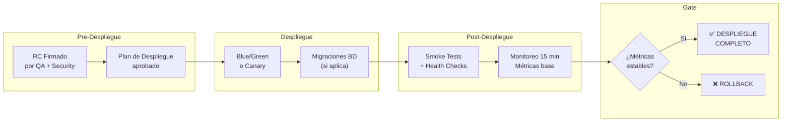

# Fase 5 — Entrega y Operaciones

> **Gate de salida:** Producción Activa — Monitoreo Nominal
> **Propósito:** Desplegar el release candidate a producción, verificar telemetría operativa, validar el plan de rollback y asegurar que el producto está siendo monitoreado antes de declarar la entrega completa.

---

## 1. Flujo General de Entrega

---

<strong>Release y Despliegue</strong>

### Propósito

Ejecutar el despliegue del RC a producción con la estrategia correcta (Blue/Green, Canary o Rolling Update), minimizando el tiempo de inactividad y maximizando la capacidad de rollback.

### ¿Por qué?

- Los despliegues manuales son la principal causa de incidentes en producción ([Google SRE](https://sre.google/sre-book/)).
- Una estrategia de despliegue definida reduce el MTTR de 30 min a < 5 min.
- El rollback plan debe probarse antes del deploy, no durante el incidente.

### ¿Cuándo?

| Momento | Acción | Responsable |
| :------ | :----- | :---------- |
| F4 — Validación (Gate) | Plan de despliegue aprobado, RC firmado | QA + Security Lead |
| F5 — Entrega (ventana) | Ejecutar despliegue según estrategia | DevOps |
| F5 — Post-despliegue | Smoke tests + monitoreo | DevOps + QA |

### Documentos

| Documento | Tipo | R/O | Propósito |
| :-------- | :--- | :-: | :-------- |
| [Plan de Despliegue](../../governance/standards/engineering/plantilla-plan-despliegue.es.md) | Plantilla | **R** | Estrategia, secuencia, rollback y verificación post-despliegue |
| [Notas de Lanzamiento](../../governance/sdlc/04-plantillas-artefactos/plantilla-notas-lanzamiento.es.md) | Plantilla | **R** | Comunicación del release a usuarios |
| [Guía Post-Despliegue](../../governance/standards/engineering/guia-post-despliegue.es.md) | Guía | **R** | Checklist, criterios de rollback, script k6 smoke test |
| [Estrategia de Ramificación GitFlow](../../governance/sdlc/estrategia-ramificacion.es.md) | Guía | **R** | Modelo de ramas, flujo de promoción, Pull Requests, estándar de commits. Define cómo se crean, fusionan y despliegan los releases |

### Estrategias de Despliegue

| Estrategia | Propósito | Cuándo usarla | Riesgo | Tiempo de rollback |
| :--------- | :-------- | :------------ | :----- | :----------------- |
| **Blue/Green** | Entorno idle preparado para conmutación inmediata | Releases mayores, cambios de BD | Bajo | < 1 min |
| **Canary** | % de tráfico incremental (10% → 50% → 100%) | Releases con alta criticidad | Medio | < 2 min (revertir canary) |
| **Rolling Update** | Actualización gradual de pods (batch 2, intervalo 30s) | Releases menores, hotfixes | Medio | 5 min (re-escalar versión anterior) |
| **Feature Flag** | Activación/desactivación sin redeploy | Funcionalidades condicionales | Bajo | Instantáneo (toggle) |

### Herramientas

| Herramienta | Propósito | Instalación | Uso | Licencia |
| :---------- | :-------- | :---------- | :-- | :------- |
| [Kubernetes](https://kubernetes.io/) | Orquestación de contenedores y rolling updates | [instalación](https://kubernetes.io/docs/setup/) | [docs](https://kubernetes.io/docs/concepts/workloads/controllers/deployment/) | Apache 2.0 (gratuita) |
| [Helm v3](https://helm.sh/) | Gestión de paquetes Kubernetes | [instalación](https://helm.sh/docs/intro/install/) | [docs](https://helm.sh/docs/) | Apache 2.0 (gratuita) |
| [Docker](https://www.docker.com/) | Contenedores multi-stage build, distroless | [instalación](https://docs.docker.com/get-docker/) | [docs](https://docs.docker.com/) | Apache 2.0 (gratuita) |
| [Ingress Controller](https://kubernetes.io/docs/concepts/services-networking/ingress/) | API Gateway de borde para canary routing | [instalación](https://kubernetes.github.io/ingress-nginx/deploy/) | [docs](https://kubernetes.io/docs/concepts/services-networking/ingress/) | Apache 2.0 (gratuita) |
| [GitHub Actions](https://github.com/features/actions) | CI/CD pipeline automatizado | Nativo en GitHub | [docs](https://docs.github.com/en/actions) | Gratuito para repos públicos |

---

<strong>Observabilidad</strong>

### Propósito

Garantizar que el sistema desplegado es observable: métricas, logs, trazas y alertas funcionan antes de declarar la entrega completa.

### ¿Por qué?

- Sin observabilidad, un incidente en producción se detecta cuando el usuario lo reporta ([Grafana Labs](https://grafana.com/)).
- El estándar OpenTelemetry permite cambiar de vendor sin cambiar instrumentación.
- Las alertas automáticas reducen el MTTR de horas a minutos.

### ¿Cuándo?

| Momento | Acción | Responsable |
| :------ | :----- | :---------- |
| F4 — Validación | Verificar que dashboards muestran datos del RC | DevOps |
| F5 — Post-despliegue (inmediato) | Confirmar métricas RED + USE dentro de SLOs | DevOps |
| F5 — Post-despliegue (15 min) | Validar que alertas están configuradas y no hay falsos positivos | DevOps |

### Métricas Clave

| Patrón | Métrica | SLO objetivo | Herramienta |
| :----- | :------ | :----------- | :---------- |
| **RED** | Rate (requests/s) | ≥ esperado | Prometheus |
| **RED** | Errors (error rate) | < 1% | Prometheus |
| **RED** | Duration (p95 latency) | < 2s | Prometheus |
| **USE** | Utilization (CPU/Mem) | < 80% | Prometheus + Node Exporter |
| **USE** | Saturation (queue depth) | < 100 | Prometheus |
| **USE** | Errors (system errors) | 0 | Prometheus + Loki |

### Documentos

| Documento | Tipo | R/O | Propósito |
| :-------- | :--- | :-: | :-------- |
| [Hub de Operaciones](../../operations/README.md) | Estándar | **R** | Runbooks, troubleshooting, SLIs/SLOs |
| [Estrategia de Monitoreo](../../governance/standards/engineering/estrategia-monitoreo.es.md) | Guía | **R** | Stack LGTM + Prometheus, métricas RED/USE, dashboards, alertas, SLIs/SLOs |
| [Playbook de Observabilidad](../../governance/standards/engineering/playbook-observabilidad.es.md) | Estándar | O | Guía de buenas prácticas de observabilidad |
| [Guía Post-Despliegue](../../governance/standards/engineering/guia-post-despliegue.es.md) | Guía | **R** | Verificación de métricas post-despliegue |

### Herramientas

| Herramienta | Propósito | Instalación | Uso | Licencia |
| :---------- | :-------- | :---------- | :-- | :------- |
| [OpenTelemetry](https://opentelemetry.io/) | Instrumentación vendor-neutral (trazas, métricas, logs) | [SDK](https://opentelemetry.io/docs/languages/) | [docs](https://opentelemetry.io/docs/) | Apache 2.0 (gratuita) |
| [Prometheus](https://prometheus.io/) | Recolección de métricas + Alertmanager | [guía](https://prometheus.io/docs/prometheus/latest/installation/) | [docs](https://prometheus.io/docs/introduction/overview/) | Apache 2.0 (gratuita) |
| [Grafana](https://grafana.com/) | Dashboards y visualización | [instalación](https://grafana.com/docs/grafana/latest/setup-grafana/installation/) | [docs](https://grafana.com/docs/grafana/latest/) | AGPL 3.0 (gratuita) / Cloud (paga) |
| [Grafana Loki](https://grafana.com/oss/loki/) | Agregación de logs estructurados | [instalación](https://grafana.com/docs/loki/latest/installation/) | [docs](https://grafana.com/docs/loki/latest/) | AGPL 3.0 (gratuita) |
| [Grafana Tempo](https://grafana.com/oss/tempo/) | Almacén de trazas distribuidas | [instalación](https://grafana.com/docs/tempo/latest/setup/) | [docs](https://grafana.com/docs/tempo/latest/) | AGPL 3.0 (gratuita) |
| [Grafana Mimir](https://grafana.com/oss/mimir/) | Almacén de métricas escalable | [instalación](https://grafana.com/docs/mimir/latest/) | [docs](https://grafana.com/docs/mimir/latest/) | AGPL 3.0 (gratuita) |

---

<strong>Infraestructura</strong>

### Propósito

Definir la topología de infraestructura, estrategia de disaster recovery, aprovisionamiento y configuración de red que soporta los productos Unimar.

### ¿Por qué?

- La infraestructura como código (IaC) elimina la deriva de configuración entre entornos.
- Una topología multi-AZ garantiza disponibilidad incluso ante fallos de zona.
- El DR plan debe probarse al menos una vez al año, no durante un desastre real.

### ¿Cuándo?

| Momento | Acción | Responsable |
| :------ | :----- | :---------- |
| F2 — Diseño | Definir topología y requisitos de infraestructura | Arquitecto + DevOps |
| F3 — Construcción | Aprovisionar entornos mediante IaC | DevOps |
| F5 — Entrega | Verificar que infraestructura de producción está lista | DevOps |
| Anual | Probar DR plan + failover | DevOps + DBA |

### Documentos

| Documento | Tipo | R/O | Propósito |
| :-------- | :--- | :-: | :-------- |
| [Hub de Infraestructura](../../infrastructure/README.md) | Estándar | **R** | Topología cloud, DR, contenedores, redes |
| [ADR-0013](../../architecture/adrs/core/0013-topologia-infraestructura-cloud-dr.es.md) | Decisión | **R** | Topología multi-AZ y disaster recovery |
| [ADR-0028](../../architecture/adrs/core/0028-infraestructura-hibrida-autogestionada.es.md) | Decisión | O | Infraestructura on-premise o cloud híbrida |

### Componentes de Infraestructura

| Componente | Tecnología | Propósito | Alternativa |
| :--------- | :--------- | :-------- | :---------- |
| **Orquestación** | Kubernetes (K8s) | Gestión de contenedores en producción | — |
| **API Gateway** | Ingress Controller | Borde de tráfico, rate limiting, autenticación | — |
| **Base de Datos .NET** | SQL Server | Persistencia relacional para runtime .NET | PostgreSQL (con ADR) |
| **Base de Datos Node.js** | PostgreSQL | Persistencia relacional para runtime Node.js | MongoDB (NoSQL) |
| **Cache** | Redis | Caché distribuida, sesiones, rate limiting | — |
| **Mensajería** | RabbitMQ | Colas FIFO, DLQ, control de flujo | Kafka (streaming pesado) |
| **Secretos** | HashiCorp Vault | Gestión de credenciales y certificados | — |
| **Almacenamiento** | MinIO (S3) | Almacenamiento de objetos | AWS S3 (si aplica) |
| **Logs** | Grafana Loki | Agregación de logs estructurados | — |
| **Métricas** | Prometheus + Grafana | Recolección y visualización de métricas | — |

### Herramientas

| Herramienta | Propósito | Instalación | Uso | Licencia |
| :---------- | :-------- | :---------- | :-- | :------- |
| [Kubernetes](https://kubernetes.io/) | Orquestación de contenedores | [instalación](https://kubernetes.io/docs/setup/) | [docs](https://kubernetes.io/docs/) | Apache 2.0 |
| [Helm v3](https://helm.sh/) | Charts Kubernetes | [instalación](https://helm.sh/docs/intro/install/) | [docs](https://helm.sh/docs/) | Apache 2.0 |
| [Docker](https://www.docker.com/) | Contenedores | [instalación](https://docs.docker.com/get-docker/) | [docs](https://docs.docker.com/) | Apache 2.0 |
| [Ingress Controller](https://kubernetes.io/docs/concepts/services-networking/ingress/) | API Gateway | [guía](https://kubernetes.github.io/ingress-nginx/deploy/) | [docs](https://kubernetes.io/docs/concepts/services-networking/ingress/) | Apache 2.0 |
| [HashiCorp Vault](https://www.vaultproject.io/) | Gestión de secretos | [guía](https://developer.hashicorp.com/vault/docs/install) | [docs](https://developer.hashicorp.com/vault/docs) | BUSL (gratuita) / Enterprise (paga) |
| [MinIO](https://min.io/) | Almacenamiento S3 | [guía](https://min.io/docs/minio/container/index.html) | [docs](https://min.io/docs/) | AGPL 3.0 (gratuita) |
| [RabbitMQ](https://www.rabbitmq.com/) | Mensajería AMQP | [instalación](https://www.rabbitmq.com/download.html) | [docs](https://www.rabbitmq.com/documentation.html) | MPL 2.0 (gratuita) |
| [Redis](https://redis.io/) | Cache distribuida | [instalación](https://redis.io/docs/latest/operate/oss_and_stack/install/) | [docs](https://redis.io/docs/latest/) | BSD 3-Clause (gratuita) |
| [SQL Server](https://www.microsoft.com/sql-server) | Base de datos .NET | [guía](https://learn.microsoft.com/sql/database-engine/install-windows/) | [docs](https://learn.microsoft.com/sql/) | Express (gratuita) / Standard+Enterprise (paga) |
| [PostgreSQL](https://www.postgresql.org/) | Base de datos Node.js | [instalación](https://www.postgresql.org/download/) | [docs](https://www.postgresql.org/docs/) | PostgreSQL License (gratuita) |
| [MongoDB](https://www.mongodb.com/) | BD NoSQL Node.js | [instalación](https://www.mongodb.com/docs/manual/installation/) | [docs](https://www.mongodb.com/docs/) | SSPL (gratuita) / Enterprise (paga) |

---

<strong>Opcionales</strong>

| Documento | Tipo | R/O/C | Propósito | Cuándo usarlo | Estándar |
| :-------- | :--- | :---- | :-------- | :------------ | :------- |
| [ADR-0011](../../architecture/adrs/core/0011-patrones-resiliencia-tolerancia-fallos.es.md) | Decisión | O | Circuit breakers, bulkheads, retry | Producción crítica | — |
| [ADR-0017](../../architecture/adrs/core/0017-estrategia-feature-flags.es.md) | Decisión | O | Rollout gradual, dark launches | Exposición controlada | — |
| ADR-0060 | Decisión | O | Feature flags centralizados en UMS | Implementación UMS | — |
| [ADR-0028](../../architecture/adrs/core/0028-infraestructura-hibrida-autogestionada.es.md) | Decisión | O | On-premise o cloud híbrida | Despliegue on-premise | — |
| [ADR-0046](../../architecture/adrs/core/0046-dapr-observabilidad-unificada.es.md) | Decisión | O | Observabilidad de sidecars Dapr | Dapr activo | — |
| [Estrategia de Base de Datos](../../governance/standards/engineering/estrategia-base-datos.es.md) | Estrategia | O | Selección de motor BD por runtime, diseño 3NF, normalización | Nuevos proyectos | ISO/IEC 25010, ADR-0051, ADR-0054 |

---

## 2. Relación con Seguridad

La Fase 5 hereda los gates de seguridad de Fase 4. Ver [Estrategia de Pruebas de Seguridad](../../governance/sdlc/estrategia-seguridad.es.md) y [Plan de Pruebas de Seguridad](../../governance/standards/testing/plan-seguridad.es.md).

| Gate de Seguridad | ¿Se verifica en F5? | Cómo |
| :---------------- | :------------------ | :--- |
| Cero CVEs críticos/altos | ✅ Sí | SCA en pipeline post-merge |
| SAST sin críticas/altas | ✅ Sí | CodeQL en CI/CD |
| Secret scanning | ✅ Sí | GitLeaks en pre-commit |
| Cumplimiento checklist | ✅ Sí | Firmado antes del deploy |

---

[Volver al README principal](../../../README.md)
