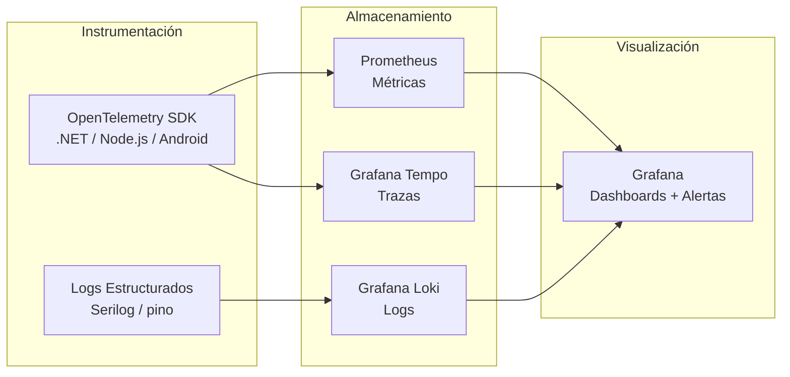

# Hub de Operaciones

> **Meta:** Observabilidad, soporte de runtime y documentación operativa para productos Unimar en producción.
> **Objetivos:** (1) Centralizar runbooks y guías de troubleshooting, (2) definir la estrategia de telemetría y alertas, (3) documentar SLIs/SLOs y procedimientos de incidentes.

Hub padre: [`../README.md`](../README.md).

---

<strong>Estrategia de Observabilidad</strong>

---

<strong>Métricas Clave (RED + USE)</strong>

| Patrón | Métrica | SLO Objetivo | Alarma si |
| :----- | :------ | :----------- | :-------- |
| **Rate** | Requests por segundo | ≥ esperado para el pico | < 50% del esperado |
| **Errors** | Tasa de error HTTP 5xx | < 1% | > 1% por 5 min |
| **Duration** | Latencia p95 | < 2s | > 3s por 5 min |
| **Utilization** | CPU / Memoria | < 80% | > 85% sostenido |
| **Saturation** | Conexiones BD activas | < 80% del pool | > 90% del pool |
| **Errors (sistema)** | Excepciones no capturadas | 0 | Cualquier excepción |

---

<strong>Documentos</strong>

| Documento | Tipo | Propósito |
| :-------- | :--- | :-------- |
| [Estrategia de Monitoreo](../governance/standards/engineering/estrategia-monitoreo.es.md) | Guía | Stack LGTM + Prometheus, métricas RED/USE, dashboards, alertas, SLIs/SLOs |
| [Estrategia de Integraciones Corporativas](../governance/standards/engineering/estrategia-integraciones.es.md) | Guía | Monitoreo de integraciones externas (SUNAT, SAP, clientes, proveedores) |
| [Playbook de Observabilidad](../governance/standards/engineering/playbook-observabilidad.es.md) | Estándar | Guía de buenas prácticas de observabilidad |
| [Flujo de Arquitectura de Observabilidad](../architecture/flujo-arquitectura-observabilidad.es.md) | Blueprint | Pipelines Grafana, Loki, Tempo y OTel |
| [Guía Post-Despliegue](../governance/standards/engineering/guia-post-despliegue.es.md) | Guía | Checklist de verificación post-despliegue |
| [ADR-0007 — Observabilidad con OTel y Loki](../architecture/adrs/nodejs/0007-observabilidad-telemetria-loki-opentelemetry.es.md) | Decisión | Tracing y logging estructurado |
| [ADR-0046 — Observabilidad Unificada con Dapr](../architecture/adrs/core/0046-dapr-observabilidad-unificada.es.md) | Decisión | Observabilidad de sidecars Dapr |

---

<strong>Herramientas</strong>

| Herramienta | Propósito | Instalación | Uso | Licencia |
| :---------- | :-------- | :---------- | :-- | :------- |
| [OpenTelemetry](https://opentelemetry.io/) | Instrumentación vendor-neutral | [SDK](https://opentelemetry.io/docs/languages/) | [docs](https://opentelemetry.io/docs/) | Apache 2.0 |
| [Prometheus](https://prometheus.io/) | Métricas + Alertmanager | [guía](https://prometheus.io/docs/prometheus/latest/installation/) | [docs](https://prometheus.io/docs/introduction/overview/) | Apache 2.0 |
| [Grafana](https://grafana.com/) | Dashboards y visualización | [instalación](https://grafana.com/docs/grafana/latest/setup-grafana/installation/) | [docs](https://grafana.com/docs/grafana/latest/) | AGPL 3.0 |
| [Grafana Loki](https://grafana.com/oss/loki/) | Agregación de logs | [instalación](https://grafana.com/docs/loki/latest/installation/) | [docs](https://grafana.com/docs/loki/latest/) | AGPL 3.0 |
| [Grafana Tempo](https://grafana.com/oss/tempo/) | Trazas distribuidas | [instalación](https://grafana.com/docs/tempo/latest/setup/) | [docs](https://grafana.com/docs/tempo/latest/) | AGPL 3.0 |
| [Grafana Mimir](https://grafana.com/oss/mimir/) | Métricas escalables | [instalación](https://grafana.com/docs/mimir/latest/) | [docs](https://grafana.com/docs/mimir/latest/) | AGPL 3.0 |
| [Alertmanager](https://prometheus.io/docs/alerting/latest/alertmanager/) | Alertas | [guía](https://prometheus.io/docs/alerting/latest/alertmanager/installation/) | [docs](https://prometheus.io/docs/alerting/latest/alertmanager/) | Apache 2.0 |

---

> **Nota:** Este directorio está preparado para albergar runbooks, guías de troubleshooting, definiciones de SLIs/SLOs y procedimientos de gestión de incidentes.

  <strong>© Unimar S.A.</strong> · RUC 20100412447 · Operador Logístico Aduanero desde 1978 
  Última revisión: 2026-06-11

